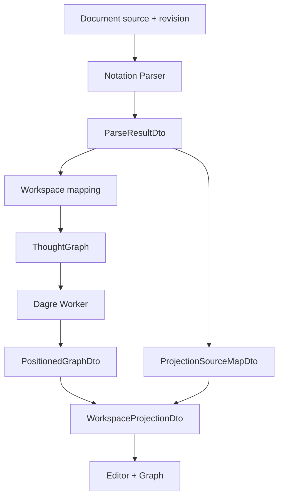
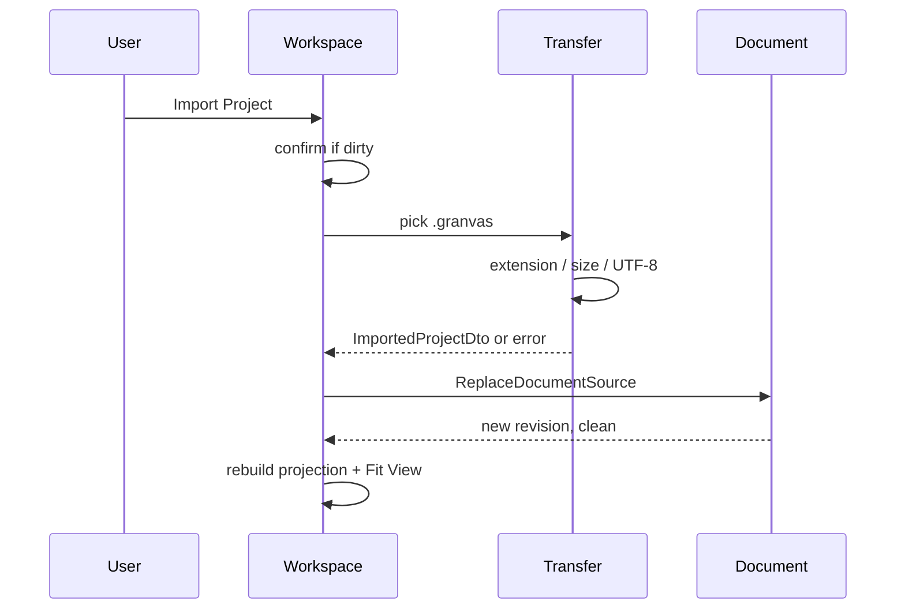

# Initial Implementation Design

> Date: 2026-08-10  
> Status: Draft / Approval Candidate

## 1. Implementation Approach

ContextごとにDomain / Application contractを先に実装し、InfrastructureとPresentationを後から接続する。最初にParserをexecutable specificationとして固定し、そのDTOをGraph / Workspaceへ渡す。



## 2. Module Changes

### Document

Implement:

- `GranvasDocument`
- `DocumentRevision`
- `DocumentDirtyState`
- `CreateDocument`
- `UpdateDocumentSource`
- `ReplaceDocumentSource`
- `MarkProjectDownloaded`

Document stateはin-memoryで保持する。Repository portは作成しない。

### Notation

Implement:

- candidate classifier。
- indentation / Group state machine。
- AST / Parsed DTO。
- reference resolver。
- Diagnostic codes / ranges。
- occurrence key generator。
- CodeMirror syntax / diagnostic adapter。

Parserはcurrent sourceだけから結果を生成するpure TypeScript serviceとする。

### Graph

Implement:

- `ThoughtGraph`, `GraphNode`, `GraphEdge`, `GraphGroup`。
- Parse DTO mapping。
- `GraphLayoutInputDto`, `PositionedGraphDto`。
- `GraphLayoutPort`, `CancellationSignal`。
- Dagre Worker adapter。
- Group overlay bounds。
- `GraphExportSceneDto`。
- React Flow read-only view。

Graph Domainに`SourceRange`を含めない。

### Transfer

Implement:

- `DownloadFormat`, file name validation, import validation。
- `ProjectFilePickerPort`, `FileDownloadPort`, `GraphExportPort`。
- Browser picker / Blob download adapters。
- `.granvas`, SVG, PNG, PDF file generation。
- Download dialogとstatus。

PDF adapterはADR完了後に実装する。

### Workspace

Implement:

- public facadeのorchestration。
- revision / cancellation / latest-wins。
- `ProjectionSourceMapDto`。
- Text / Graph selection mapping。
- Import confirmation / replacement。
- Download inputのassembly。
- Workspace ViewModel / StatusBar。

## 3. Core Contracts

### SourceRange

```ts
type SourceRangeDto = {
  from: number;
  to: number;
  line: number;
  column: number;
};
```

`from/to`は0-based UTF-16 half-open range。lineは1-based、columnは0-based。

### Revisioned Projection

```ts
type WorkspaceProjectionDto = {
  revision: number;
  graph: PositionedGraphDto;
  sourceMap: ProjectionSourceMapDto;
  diagnostics: DiagnosticDto[];
};
```

commit前に3要素のrevision一致をassertする。

### Internal Identity

- Parser occurrence key: `${kind}:${sourceRange.from}` + collision suffix。
- user reference: `explicitId`。
- Graph IDs: occurrence key由来。
- duplicate explicit IDでもGraph IDは一意。

### Graph Bounds

- Node: 240 × 88 CSS px。
- Group padding: 24px。
- Graph Export padding: 24px。
- `x/y`: top-left。

## 4. Parser State Machine

1. sourceをline endingを保持したままscanする。
2. lineのindentとreserved prefixでcandidate typeをcommitする。
3. Group scopeとNode parent stackを更新する。
4. syntax要素をParsed DTOへ変換する。
5. document-wide explicit ID indexを作る。
6. Cross Relation / Group referenceをforward referenceを含めて解決する。
7. Graphへ渡せるpartial resultとDiagnosticsを返す。

Group rules:

- Group Headerはindent 0。
- base indentは2 spaces。
- next non-empty indent 0 lineでscopeを閉じる。
- blank / unmatched indented Plain Textはscopeを閉じない。
- nested Groupはdiagnosticにして生成しない。

Recovery:

- invalid candidateはPlain Textへfallbackしない。
- invalid要素だけを省略する。
- orphan relationのvalid child Nodeは保持する。
- previous revisionのlast-known-good要素は混在させない。

## 5. Async Design

Workspaceはcurrent revisionごとにprojection jobを持つ。

```text
source change
→ increment revision
→ cancel previous layout
→ parse current source
→ create semantic graph + source map
→ request worker layout
→ compare completed revision with current
→ commit or discard
```

Parser / mapping errorはResultへ変換する。Worker crash時はGraph errorを表示し、Textとdirty stateを維持する。

## 6. Import Design



Validation failure、cancel、read errorはDocumentを変更しない。

## 7. Download Design

### `.granvas`

- current sourceからUTF-8 Blobを生成する。
- BOMを付けない。
- source text以外を含めない。
- browser download start成功時にcurrent revisionをclean baselineへ設定する。

### SVG / PNG / PDF

- current `GraphExportSceneDto`を入力にする。
- full graph boundsを使用する。
- format-specific adapterが文字列をescapeする。
- visual formatはdirty stateを変更しない。
- Nodeが0件ならdialogでdisableする。

## 8. Presentation Composition

`src/app/App.tsx`が以下を公開API経由で合成する。

- `WorkspaceSplitPane`
- `GranvasEditor`
- `ReactFlowGraphView`
- `DownloadDialog`
- `StatusBar`

EventはcallbackでWorkspace Applicationへ戻す。ApplicationからPresentation commandを直接importしない。Editor scroll / selectionはWorkspace ViewModelのeffectをPresentationが解釈する。

## 9. Security Design

- Import contentをplain text / untrustedとして扱う。
- source由来文字列をReact text nodeまたはsafe serializerへ渡す。
- `dangerouslySetInnerHTML`を使用しない。
- SVG/XML attributeをallowlistする。
- file nameをsanitizationする。
- production CSPをVercel responseに設定する。
- asset load後のnetwork requestをE2Eで監視する。

## 10. Test Design

### Unit / Golden

- syntax、commit point、indentation、Group、reference、diagnostics。
- SourceRange UTF-16 / CRLF / emoji。
- occurrence key決定性。
- Graph mapping、Group bounds、layout input。
- dirty state transition。

### Application

- delayed old layout vs fast new layout。
- Import confirmation / cancel / failure。
- `.granvas`だけがclean baselineを更新。
- visual formatsはdirtyを維持。

### Infrastructure

- file size / encoding / BOM。
- Blob MIME / extension / content。
- SVG escaping、PNG bounds、PDF page bounds。
- Worker cancellation / mapping。

### E2E

1. Text → Graph → click → Text。
2. `.granvas` Download → Import → resume。
3. incomplete candidateでも他Graph維持。
4. SVG / PNG / PDF full graph Download。
5. stale layoutをcommitしない。
6. keyboard Node → Text。

## 11. Impact

- 現在のVite starter UIは置換対象。
- `src/modules/*`と`src/shared/*`を新設する。
- PDF library選定により`package.json` / `bun.lock`へ変更が必要になる。
- Vercel config、Playwright config、boundary lint rule、Worker build configを追加する。
- v0.1でlocalStorageやSupabase関連codeは追加しない。
