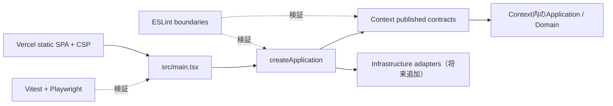

# Phase 1 プロジェクト基盤 設計

> 作成日: 2026-08-10  
> ステータス: 承認済み  
> 関連: `requirements.md`, `docs/architecture.md`, `docs/repository-structure.md`

## 1. 実装方針

既存Vite starterを動作可能なまま、最小のcomposition rootと検証可能なarchitecture guardrailを追加する。Phase 2以降のdomain実装を先取りせず、実ファイルが必要になったときにだけ各Layerを作成する。



## 2. 変更するコンポーネント

### 2.1 Application composition

- `src/app/bootstrap/createApplication.ts`
  - framework非依存の`Application` descriptorを返す。
  - Phase 1ではアプリケーション名等、起動確認に必要な不変metadataだけを保持する。
  - 将来、各Context facadeとbrowser adapterの生成・注入をこの関数へ集約する。
- `src/app/App.tsx`
  - starter componentを配置先へ移し、`Application`をpropsとして受け取る。
- `src/main.tsx`
  - `createApplication()`を1回だけ呼び、`App`へ渡す。

既存starter UIの見た目はPhase 1では置換しない。assetとCSSの相対参照だけを移動後の構造に合わせる。

### 2.2 Context skeleton

既存の`src/modules/{document,notation,graph,workspace}/index.ts`はpublished contract入口として維持する。承認済み構造に不足する`src/modules/transfer/index.ts`を追加する。

`domain` / `application` / `infrastructure` / `presentation`の空directoryや`src/shared/*`は作らない。Phase 2以降、実装ファイルと同時に追加する。

### 2.3 Path alias

- `tsconfig.app.json`: `baseUrl`と`paths`に`@/* -> src/*`を追加する。
- `tsconfig.node.json`: Vite/Vitest/Playwright設定から共通型を参照できるよう対象設定ファイルをincludeする。
- `vite.config.ts`: Node URLから絶対pathを求め、`resolve.alias`へ`@`を設定する。
- `vitest.config.ts`: Vite設定をmergeしてaliasを共有する。

### 2.4 ESLint architecture guardrail

追加dependencyを増やさず、flat configのfile patternと`no-restricted-imports` / `no-restricted-globals`を組み合わせる。

| 対象 | 禁止する依存 |
| --- | --- |
| `src/modules/*/domain/**` | application / infrastructure / presentation、React系package、browser global |
| `src/modules/*/application/**` | infrastructure / presentation、React系package、browser global |
| `src/modules/<context>/**` | 他Contextの内部path |
| Workspace以外のContext | 他Contextのpublished入口 |
| Context外 | `src/modules/<context>/index.ts`以外のContext内部path |

Context名を列挙したconfig helperを`eslint.config.js`内に閉じ込め、対象Context追加時に一箇所で更新できるようにする。Phase 1ではconfig自体に対するVitestからESLint APIを呼ぶfixture testを追加し、許可例と禁止例を検証する。

### 2.5 Vitest

- `vitest.config.ts`: jsdom、setup file、CSS処理、coverage対象を設定する。
- `src/test/setup.ts`: `@testing-library/jest-dom/vitest`を読み込む。
- `src/app/bootstrap/createApplication.test.ts`: descriptorの決定性とreadonly contractを検証する。
- `src/test/architecture-boundaries.test.ts`: in-memory fixtureまたは一時fixtureをESLint APIで検証する。
- `src/test/vercel-config.test.ts`: `vercel.json`を読み込み、SPA rewrite、output、CSP/security headersを検証する。

testから設定JSONを読むためのNode環境testはファイル単位のenvironment指定を利用し、production sourceへNode APIを混入させない。

### 2.6 Playwright

- `playwright.config.ts`
  - `testDir: tests/e2e`
  - Chromium / Firefox / WebKitの3 project。
  - `webServer`で`bun run preview -- --host 127.0.0.1 --port 4173`を起動する。
  - CIではretryとtraceを有効化し、localでは既存serverを再利用する。
- `tests/e2e/bootstrap.spec.ts`
  - rootでstarter headingが表示されることを検証する。
  - history APIで直接pathへ移動した場合の表示は、Vercel rewrite契約testとproduction相当serverの検証で補う。

### 2.7 Vercel

rootの`vercel.json`に公式schemaを指定し、以下を定義する。

- `framework: "vite"`
- `buildCommand: "bun run build"`
- `outputDirectory: "dist"`
- asset pathを除くSPA requestの`/index.html` rewrite。
- 全pathにCSP、`X-Content-Type-Options`、`Referrer-Policy`を付与。

Vercelの`headers`はmatching後もrewrite処理を妨げない構成とする。設定形式はVercel公式のProject Configurationに従う。

## 3. CSP設計

初期policyは次を基準とする。

```text
default-src 'self';
script-src 'self';
style-src 'self' 'unsafe-inline';
img-src 'self' data: blob:;
font-src 'self';
connect-src 'none';
object-src 'none';
base-uri 'none';
frame-ancestors 'none';
form-action 'none'
```

`style-src 'unsafe-inline'`はVite/React ecosystemおよび将来のReact Flow描画との互換性のためPhase 1では許容する。`script-src`に`unsafe-inline` / `unsafe-eval`は許可しない。将来remote APIを追加する場合も、先に仕様とCSP契約を更新する。

## 4. ファイル変更予定

### 追加

- `src/app/bootstrap/createApplication.ts`
- `src/app/bootstrap/createApplication.test.ts`
- `src/app/App.tsx`
- `src/modules/transfer/index.ts`
- `src/test/setup.ts`
- `src/test/architecture-boundaries.test.ts`
- `src/test/vercel-config.test.ts`
- `tests/e2e/bootstrap.spec.ts`
- `vitest.config.ts`
- `playwright.config.ts`
- `vercel.json`

### 変更・移動

- `src/App.tsx` → `src/app/App.tsx`
- `src/App.css` → `src/app/App.css`
- `src/main.tsx`
- `package.json`
- `bun.lock`（scriptだけならdependency変更なし）
- `eslint.config.js`
- `tsconfig.app.json`
- `tsconfig.node.json`
- `vite.config.ts`
- `.steering/20260810-initial-implementation/tasklist.md`

### 永続文書

仕様変更を伴わないため`docs/*.md`は更新しない。承認済みbaseline文書は退避から作業branchへ戻し、Phase 1と同一PRに含める。

## 5. テスト戦略

### 自動検証

- Bootstrap contract: metadataと生成単位。
- Architecture lint: 禁止import、公開入口、browser global。
- Vercel config: Vite static output、SPA fallback、必須CSP directive、security headers、server function不在。
- E2E smoke: 3 browser engineでapplication bootstrapが成功する。

### 手動・runtime検証

- production buildをVite previewで起動する。
- root pageが表示され、console errorと失敗requestがないことをbrowserで確認する。
- fallback検証用のlocal static servingで任意pathが`index.html`へ解決されることを確認する。
- 可能ならVercel previewでresponse headersとdirect accessを確認する。ただしexternal deployが未設定または認証で阻まれる場合は、local contractを完了条件とし、本番deployはPhase 7へ残す。

## 6. 影響分析

- プロダクトの挙動: starter UIの表示内容は変えず、起動経路だけcomposition root経由になる。
- Architecture: 既存文書の境界をlintで実行可能な制約へ変換する。
- Build: Vite outputは`dist`のまま。server runtimeは増えない。
- Security: production responseにdeny-by-default寄りのCSPを追加する。
- Authentication: 変更なし。Supabase dependencyやcredentialは導入しない。
- Persistence: 変更なし。Import / DownloadはPhase 6対象。

## 7. リスクと対策

- ESLint patternの過不足: 許可・禁止fixtureをtestし、設定変更時のregressionを防ぐ。
- CSPで開発serverを壊す: CSPはVercel production responseだけに設定し、production previewとbuild artifactを検証する。
- 3 browser binary未導入: Playwrightの必要browserをinstallし、全projectを実行する。
- SPA fallbackのlocal再現差: Vercel設定contract testとpreview相当のfallback検証を分ける。
- 空のpublished contract: lintで利用する入口として明確に維持し、内部APIを先行実装しない。
