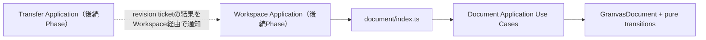

# Phase 2 Document コンテキスト 設計

> 作成日: 2026-08-10
> ステータス: 承認済み
> 関連: `requirements.md`, `docs/functional-design.md`, `docs/architecture.md`

## 1. 実装方針

Document Domainをimmutableな値とpure transitionで実装し、Applicationがdomain値をimmutable DTOへ変換してpublished contractとして公開する。v0.1はsingle active documentをWorkspaceが保持するため、repositoryやbrowser adapterは作成しない。



## 2. Domain Model

### 2.1 GranvasDocument

`src/modules/document/domain/GranvasDocument.ts`に以下の概念を置く。

```ts
type DocumentRevision = number

type DocumentLifecycle =
  | { readonly status: 'stable' }
  | { readonly status: 'exporting'; readonly revision: DocumentRevision }
  | { readonly status: 'error'; readonly message: string }

type GranvasDocument = Readonly<{
  name: string
  source: string
  revision: DocumentRevision
  cleanBaselineRevision: DocumentRevision
  lifecycle: DocumentLifecycle
}>
```

`clean` / `dirty`は`revision === cleanBaselineRevision`から導出し、published DTOのstatusへ`clean | dirty | exporting | error`として写像する。`exporting` / `error`中もdirty判定を失わないよう、baselineを独立して保持する。

### 2.2 Invariants

- revisionとclean baselineは0以上のsafe integer。
- clean baselineはcurrent revisionを超えない。
- exporting revisionは開始時点のcurrent revisionであり、0以上かつcurrent revision以下。
- error messageはtrim後に空でない。
- domain transitionは入力Documentを変更せず、新しいreadonly valueを返す。
- source textは正規化・trimせず、そのまま保持する。

### 2.3 Transition Table

| Operation | revision | baseline | lifecycle / 公開status |
| --- | --- | --- | --- |
| Create | `0` | `0` | stable / clean |
| Update source | `+1` | 維持 | exporting中は維持、それ以外はstable / dirty |
| Replace source | `+1` | 新revision | stable / clean |
| Begin project download | 維持 | 維持 | exporting(target revision) |
| Mark downloaded(target=current) | 維持 | target | stable / clean |
| Mark downloaded(target<current) | 維持 | target | stable / dirty |
| Download failed | 維持 | 維持 | error |
| Dismiss error | 維持 | 維持 | stable / clean or dirty |

開始ticketと異なるrevision、currentより未来のrevision、現在のexport operationと対応しない完了通知はdomain errorとして拒否し、誤ったbaseline更新を防ぐ。

## 3. Application Contract

### 3.1 DTO

`src/modules/document/application/DocumentDto.ts`にframework-neutralな公開値を置く。

```ts
type DocumentStatusDto =
  | { readonly type: 'clean' }
  | { readonly type: 'dirty' }
  | { readonly type: 'exporting'; readonly revision: number; readonly dirty: boolean }
  | { readonly type: 'error'; readonly message: string; readonly dirty: boolean }

type GranvasDocumentDto = Readonly<{
  name: string
  source: string
  revision: number
  cleanBaselineRevision: number
  status: DocumentStatusDto
}>

type ProjectDownloadTicketDto = Readonly<{ revision: number }>
```

clean baselineはApplication operationが次のdirty stateを決定するために必要なため、serializableなrevision値としてDTOへ明示する。Workspaceは表示に不要なら参照しなくてよい。Domain entity自体は`index.ts`からexportせず、ApplicationがDTOとの相互変換とinvariant検証を担う。

### 3.2 Use Cases

- `CreateDocument`: 初期name / sourceからcleanなDocument stateを生成する。
- `UpdateDocumentSource`: current stateと新sourceから次revisionのdirty stateを返す。
- `ReplaceDocumentSource`: validation済みname / sourceで置換し、次revisionをbaselineとする。
- `BeginProjectDownload`: current revisionを固定したticketとexporting stateを返す。
- `MarkProjectDownloaded`: ticket revisionだけをbaselineへ反映する。
- `MarkProjectDownloadFailed`: source / revision / baselineを維持してerror stateへ移す。
- `DismissDocumentError`: baselineとの差に応じたstable stateへ戻す。

各use caseはTransferやbrowser APIを呼ばない。将来WorkspaceがTransferの結果を受け、対応するDocument operationを呼ぶ。

### 3.3 Public API

`src/modules/document/index.ts`はapplication DTO、application state、use case factory / functionだけをexportする。Domain内部pathはContext外から参照させない。

## 4. File Layout

### 追加予定

- `src/modules/document/domain/GranvasDocument.ts`
- `src/modules/document/domain/GranvasDocument.test.ts`
- `src/modules/document/application/DocumentState.ts`
- `src/modules/document/application/DocumentDto.ts`
- `src/modules/document/application/CreateDocument.ts`
- `src/modules/document/application/UpdateDocumentSource.ts`
- `src/modules/document/application/ReplaceDocumentSource.ts`
- `src/modules/document/application/ProjectDownloadLifecycle.ts`
- `src/modules/document/application/DocumentApplication.test.ts`

### 変更予定

- `src/modules/document/index.ts`
- `.steering/20260810-initial-implementation/tasklist.md`
- `.steering/20260810-phase-2-document-context/tasklist.md`

責務が小さく密接な場合は、過剰な1関数1ファイル化を避け、application filesを統合してよい。最終配置でもDomain / Applicationの依存方向と公開境界を維持する。

## 5. Error Design

- programmer error / stale completionはtypedな`DocumentTransitionError`として分類する。
- user sourceは空文字を許可し、内容をvalidationしない。
- Download失敗の表示messageはApplicationへ渡されたplain textとして保持し、HTMLとして解釈しない。
- transition失敗時は元Documentを変更しない。
- error値にbrowserの`ErrorEvent`、`DOMException`、`File`等を含めない。

## 6. Test Strategy

### Domain Unit Test

- create時のrevision / baseline / clean。
- source更新時のrevision増加とdirty。
- 複数更新でbaselineを維持すること。
- Project置換時のrevision増加とclean。
- exporting開始とticket revision。
- current revisionのDownload成功でclean。
- exporting中の編集後、古いrevision成功でdirtyを維持。
- failureでsource / revision / baseline維持。
- error解除でclean / dirtyへ復帰。
- invalid / stale ticket拒否とimmutability。

### Application Test

- published contractだけでCreate → Update → Replaceを実行できる。
- Begin → success / failureのDTO mappingが正しい。
- status DTOが`clean | dirty | exporting | error`を正しく表す。
- framework / browser固有値を公開しない。

### Regression / Quality

- `bun run typecheck`
- `bun run lint`
- `bun run test:run`
- `bun run build`
- `bun run e2e`はUI挙動を変更しないため原則smoke regressionとして実行し、GitHub Actionsは追加しない。

## 7. Architecture Principles

- SRP: Documentはsource / revision / baseline / lifecycleだけを管理し、file I/OとUIを扱わない。
- 一方向依存: ApplicationはDomainだけへ依存し、Domainは上位Layerを参照しない。
- 疎結合: Workspaceが利用するのは`document/index.ts`のimmutable contractだけである。
- DIP: v0.1のDocumentには外部I/Oがないためportを作らない。将来永続化要件が生じるまでは不要なrepository abstractionを導入しない。

## 8. 永続文書への影響

既存仕様を具体化する実装であり、`docs/*.md`の更新は行わない。`docs/ideas/initial-requirements.md`がworking treeに存在しない点は既存baselineの文書課題として残るが、本作業では要求・設計の再生成を行わない。

## 9. リスクと対策

- Dirtyとoperation statusの混同: clean baselineを独立保持し、statusは導出する。
- 非同期Download競合: revision ticketを必須にし、完了通知が対象revisionだけをbaselineへ反映する。
- Domain entity漏洩: `index.ts`からapplication contractのみexportし、architecture test / lintでdeep importを防ぐ。
- 過剰抽象化: repository、port、infrastructure、base use caseを作らない。
- Phase番号の不一致: 本steeringは初回実装tasklistの「2. Documentコンテキスト」を対象と明記し、永続ロードマップのNotation Coreは変更しない。
