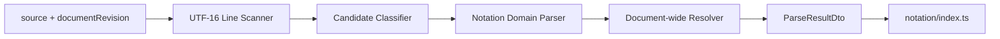

# Phase 3 Notation Core 設計

> 作成日: 2026-08-10
> ステータス: 承認省略（継続実装指示）

## 1. 構成

- Domain: line scan、candidate分類、state machine、syntax / semantic解析、recovery。
- Application: revision validation、Domain resultからimmutable DTOへのmapping、published use case `parseNotation`。
- Infrastructure: なし。
- Presentation: 今回は変更しない。

## 2. Domain Model

- `SourceRange`: UTF-16 `[from,to)`、1-based line、0-based column。
- `ParsedNode`: occurrence key、explicit ID、normalized type、trimmed label、range。
- `ParsedRelation`: nested / cross、source / target node key、optional label、range。
- `ParsedGroup`: occurrence key、name、deduplicated member node keys、range。
- `ParsedLayout`: `flow` + `TB | LR`、defaultはsource occurrenceなし。
- `Diagnostic`: code、level、message、range、related ranges、document revision。

## 3. Parse Pipeline

1. sourceをLF / CRLFを保持してlineへscanする。
2. leading whitespace、reserved prefix、open Groupからcandidateを分類する。
3. line orderでNode / nested relation / Group / Layoutを解析し、scope別parent stackを更新する。
4. explicit IDの最初の宣言をindex化し、duplicate diagnosticを作る。
5. Cross RelationとGroup referenceをforward referenceを含めて解決する。
6. invalid occurrenceだけを省略し、current source内のvalid partial resultを返す。
7. diagnosticをsource orderへ安定sortする。

## 4. Indentation / Group

- Top-level Nodeをlevel 0、2 spacesのNested Relationをlevel 1とする。
- Group base indentは2 spaces。Group member Nodeをlevel 0、4 spacesのNested Relationをlevel 1とする。
- odd spaces、level skip、scope外のindented reserved prefixは`GNV006`。
- candidate prefix前のTabは`GNV007`で、そのlineから構造を生成しない。
- Groupは次のnon-empty indent 0 lineの直前で閉じる。blank / indented Plain Textは閉じない。
- nested Groupは`GNV011`で生成しない。

## 5. Identity / Resolution

- keyは`node|edge|group|layout:<sourceRange.from>`、同kind / offset collision時だけ`:<index>`を付与する。
- explicit IDはcase-sensitive。duplicate Nodeは保持し、2件目以降へ`GNV004`と最初のrangeを付ける。
- Cross Relation / Group referenceは文書scan後に最初のexplicit ID宣言へ解決する。
- unresolved referenceは`GNV005`で該当Edge / membershipだけを省略する。

## 6. Recovery

- invalid candidateをPlain Textへ戻さない。
- invalid Nested Relationでもchild Node DeclarationがvalidならNodeを保持する。
- empty relation labelは`GNV012`を返し、labelなしEdgeを保持する。
- invalid layoutは直前のvalid layout、なければdefault TBを維持する。
- duplicate layoutは`GNV010`を返し、最後のvalid directiveを採用する。

## 7. Test

- scanner / classifierを独立testする。
- canonical fixtureと第4章必須caseをgolden / focused testで検証する。
- 全13 diagnostic codeがtest suiteに現れることを検証する。
- emoji / CRLF / BOM境界、determinism、revision isolationを検証する。
- production codeにUI / browser dependencyがないことをlintと検索で検証する。

## 8. Architecture原則

- SRP: Notationだけがsyntax、diagnostic、SourceRangeを所有する。
- 一方向依存: Application → Domain。Domainは上位layerを参照しない。
- 疎結合: Context外は`notation/index.ts`のimmutable DTOだけを利用する。
- DIP: 外部I/Oがないpure parserのためport / infrastructureを作らない。
