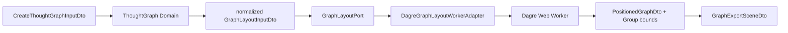

# Phase 4 Graph Core 設計

> 作成日: 2026-08-10
> ステータス: 承認省略（継続実装指示）

## 1. Architecture

GraphはNotationをimportしない。Workspaceが後でNotation published DTOから`CreateThoughtGraphInputDto`へSourceRangeを除外してmappingする。

## 2. Semantic Graph

- input node / relation / group occurrence keyを検証する。
- Graph IDは`graph-node:<key>` / `graph-edge:<key>` / `graph-group:<key>`。
- dangling relation / unknown group memberはtyped application errorとして拒否する。
- arraysと要素はreadonly / frozenとし、input orderに依存しないkey順へ正規化する。

## 3. Layout Contract

- Node size: 240 × 88。
- Group padding: 24。
- Graph export padding: 24。
- `GraphLayoutPort.layout(input, signal?)`だけをApplicationが利用する。
- `CancellationController`はbrowser APIを使わずlistener setで実装する。
- `layoutThoughtGraph`はport resultのrevisionを検証し、不一致を拒否する。

## 4. Dagre Infrastructure

- pure `layoutGraphWithDagre`がDagre Graphを構築し、Node / EdgeをID順で投入する。
- Dagreのcenter座標から`x - width/2`, `y - height/2`でtop-leftへ変換する。
- Workerはrequest / success / failure messageだけを扱う。
- Adapterはrequestごとにworkerを生成し、success / error / cancelで必ずterminateする。
- browser `Worker`型はInfrastructure内部に閉じ込める。

## 5. Group / Export Bounds

- Group memberのpositioned boundsのmin/maxに24pxを加える。
- memberが0件のGroupはzero boundsとして保持する。
- full graph boundsはNode / non-empty Groupを囲み、さらに24px paddingを加える。
- Graphが空ならzero bounds。

## 6. Test

- Semantic graph determinism / validation / duplicate and parallel structures。
- layout input normalization / fixed bounds。
- Dagre TB / LR determinism / group bounds。
- Worker adapter success / failure / cancellation contract。
- revision mismatch guard / cancellation controller。
- canonical export scene bounds。
- 200 / 300 / 10 performance fixtureの20回p95。

## 7. Architecture原則

- Domain: pure semantic invariantのみ。Dagre / Worker / SourceRange / UI禁止。
- Application: use case、DTO、port、cancellation abstraction。
- Infrastructure: Dagre / Worker具象とDTO変換。
- Composition: 後続Workspace bootstrapだけがadapterを生成・注入する。
