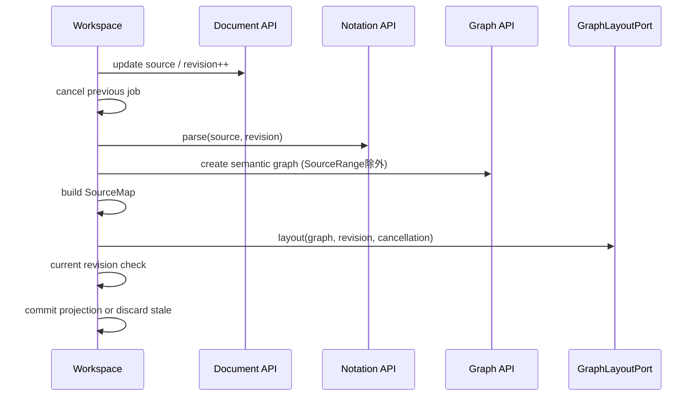

# Phase 5 Workspace Core 設計

> 作成日: 2026-08-10
> ステータス: 承認省略（継続実装指示）

## 1. Pipeline

## 2. State

- `WorkspaceSnapshotDto`: Document、current projection、status、selected Graph ID。
- stateful Application facadeをfactoryで生成し、具象layout portをconstructor dependencyとして受ける。
- job sequenceとCancellationControllerをApplication内部に保持する。
- stale / cancelled jobはerror stateへせずcommitを破棄する。

## 3. SourceMap

- Graphがkey順に返すcontractとinput occurrence keyをpairし、Graph ID → Notation SourceRangeを構築する。
- Node / Edge / Groupを別Recordで保持し、revisionを付ける。
- Graph DomainへSourceRangeを渡さない。

## 4. Selection

- `selectGraphNode(id)`はNode rangeを返し、存在しなければselectionをclearする。
- `selectSourceOffset(offset)`は`from <= offset < to`のNode rangeを解決する。
- selectionはcurrent projectionだけを参照する。

## 5. Project / Download

- dirty判定はDocument statusから導出する。
- replacementはdirtyかつ未確認なら変更せずconfirmation-requiredを返す。
- confirmed replacementはDocument APIでclean baselineを作りprojectionを再構築する。
- Download inputは`.granvas` sourceまたはcurrent export sceneのframework-neutral DTO。

## 6. Test

- canonical pipeline、empty / diagnostic partial projection。
- slow-old / fast-new latest-winsとcancellation。
- revision mismatch / layout failureでsource維持。
- SourceMap、emoji / CRLF selection。
- replacement confirmation、download assembly。
- Context internal deep importなしをarchitecture lintで確認。
