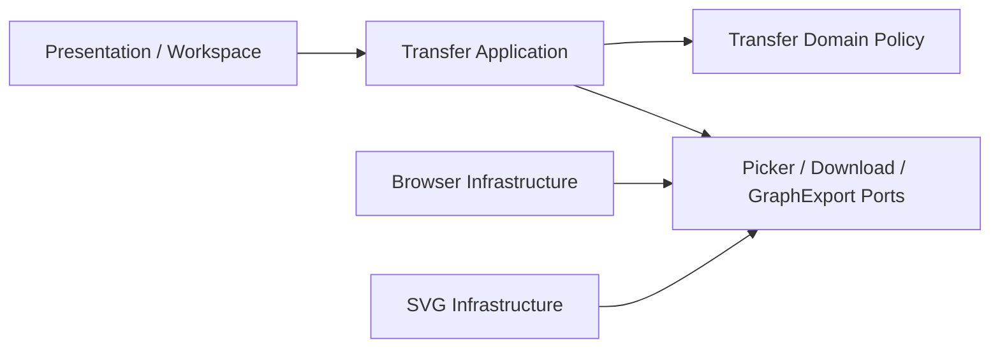

# Phase 6 Transfer Core 設計

> 作成日: 2026-08-10
> ステータス: 承認省略（継続実装指示）

## 1. Layer

## 2. Import

- Picker DTOは`name`、`size`、framework-neutralな`readBytes()`を返す。
- Applicationはextension / declared sizeを先に検証してから`readBytes()`する。
- 実bytes長も再検証する。
- `TextDecoder('utf-8', { fatal: true })`でdecodeし、先頭BOMだけ除去する。
- validation / read失敗はdiscriminated union resultとし、呼び出し側が既存Projectを維持できるようにする。

## 3. Download

- Domainがbase name sanitization、拡張子、MIMEを所有する。
- Applicationがimmutableな`DownloadFileDto`を組み立て、`FileDownloadPort`へ渡す。
- Graph exporterはTransfer所有のstructural scene DTOを受ける。Graph / Workspace Contextをimportしない。

## 4. SVG

- scene boundsを`viewBox` / document sizeに使用する。
- Group → Edge → Nodeの順で描画する。
- Edgeはsource / target Node center間を描画し、relation labelを中点へ置く。
- label / type / Group name / relation labelはXML textとしてescapeする。
- source由来HTMLを解釈するsinkを使用しない。

## 5. PNG Policy

- default scaleは2。
- `width * scale`または`height * scale`が8192を超える場合、両方が上限内になるuniform scaleへ縮小する。
- 0以下または非finite boundsはvalidation errorとする。

## 6. Test

- Domain policy table test。
- Import early rejection / strict UTF-8 / round-trip test。
- project / graph download port orchestration test。
- SVG mapping / bounds / XSS escape test。
- browser adapter contract test。
