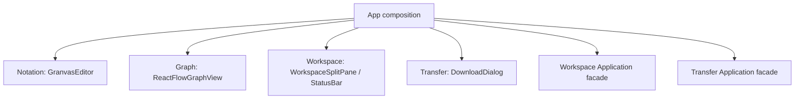

# Phase 7 Presentation Shell 設計

> 作成日: 2026-08-10
> ステータス: 承認省略（継続実装指示）

## 1. Component ownership

- Context外からは各`index.ts`のpublished componentだけをimportする。
- Appはevent / DTOを結線するが、parser / layout / file生成ruleを持たない。

## 2. React state

- authoritative stateは`WorkspaceSnapshotDto`。
- editor自身はCodeMirror documentを保持し、120ms debounce後にWorkspaceへsourceを渡す。
- source update開始時の`projecting` snapshotを即時反映し、Promise完了後にcurrent snapshotを反映する。
- cursor position、editor selection request、dialog / noticeだけをPresentation local stateとする。

## 3. Editor

- CodeMirror `EditorView`をcomponent mount中1 instance維持する。
- external source / diagnostics / Graph selectionはCompartment / effectで差分反映する。
- line classでNotation candidateを識別し、diagnostic rangeをsoft underlineする。
- composing中のdoc changeはApplicationへ通知せず、`compositionend`で全文を1回通知する。

## 4. Graph

- Positioned NodeをReact Flow Nodeへmappingする。
- Groupは`parentId`を使わず、非interactive background Nodeとして重ねる。
- graph update時はcontrolled nodes / edgesだけを更新し、viewportは変更しない。
- `fitViewKey`変更時だけ`fitView()`する。

## 5. Transfer orchestration

- Import validation成功後にWorkspace replacementを要求する。
- dirty未確認ならconfirm後に同じreplacementを`confirmed: true`で再実行する。
- `.granvas`はWorkspace download lifecycle開始 → Transfer → success / failure transition。
- SVG / PNG / PDFはDocument dirty lifecycleへ触れない。

## 6. Accessibility / Test

- pane / toolbar / status / dialogをlandmarkとaccessible nameで識別する。
- dividerは`role=separator`とvalueを持ち、Arrow keyに対応する。
- Graph Node accessible nameはtypeと完全labelを含む。
- component testでdialog / splitter / lifecycle、E2Eで初期projectionとselection flowを検証する。
