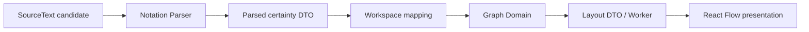

# Phase 10 Notation Certainty 設計

> 作成日: 2026-08-11
> ステータス: 承認済み（ロードマップ順での継続実装指示）

## 1. 実装経路

確信度は各境界で必須のstring literal unionとして保持する。Layout algorithmは値を読み取らず、そのままPositioned DTOへ返す。

## 2. Notation Context

- `NotationCertainty = 'neutral' | 'tentative' | 'confirmed' | 'rejected'`をdomain contractに追加する。
- candidate classifierは`->` / `?->` / `!->` / `~->`を同じRelation operator集合として判定する。
- Node parserは先頭markerをTypeと分離し、省略時`neutral`を設定する。
- Nested Relationはoperator長を固定値でsliceせず、認識したoperatorからchild宣言位置を求める。
- Cross Relation regexは4 operatorを受理し、pending relationへ確信度を保持する。
- `GNV014`だけは仕様どおり`[`から`]`までのrangeを返し、他のvalid構造を保持する。
- 既存fixture sourceは変更せず、全要素が`neutral`になる後方互換assertを追加する。

## 3. Graph / Workspace Context

- Graph Contextは独自の`GraphCertainty` unionを所有し、Node / Edge inputとdomain outputへ必須で追加する。
- WorkspaceだけがNotation DTOのcertaintyをGraph公開inputへ写像する。
- `GraphLayoutNodeDto` / `GraphLayoutEdgeDto` / `PositionedNodeDto`へcertaintyを追加し、Worker境界を往復しても保持する。
- Dagreはcertaintyをlayout計算へ使用しない。既存のNode bounds、Group bounds、並び順を維持する。
- layout result validationでcertaintyの同一性も検証する。

## 4. Presentation

- React Flow Node dataへcertaintyを渡し、certainty別classと非color markerを描画する。
- tentativeは破線と`?`、confirmedは太線と`✓`、rejectedは破線・打ち消し・`×`、neutralは既定表示とする。
- Edgeもdash / stroke width / marker text /打ち消しを組み合わせ、4状態を区別する。
- Node / EdgeのARIA labelへcertainty名を含める。
- CodeMirror decorationはNode markerとRelation markerを`cm-gnv-certainty`として別markにし、Typeと`->`の既存装飾は維持する。

## 5. Test strategy

- scanner: 4 operatorのtop-level / Group内candidateと`  ?->`入力途中。
- parser: Node / Nested / Crossの4状態、空白許容、GNV014 range / recovery、legacy fixtureのneutral互換。
- graph: domain、layout input、Worker output、Workspace projectionでcertaintyが保持されること。
- presentation:4状態の非color class / marker / accessible name、syntax decoration。
- E2E: Certainty Demoをeditorへ入力し、6 Nodes / 5 Edges、diagnostics 0、4状態表示をChromium / Firefox / WebKitで確認する。

## 6. 文書と影響範囲

- 新規仕様判断は行わず、追加済みADR-0003と統合仕様書を実装する。
- 初期要求メモの旧read-only記述と初回tasklistの旧実行順を、追加済み永続文書へ同期する。
- roadmapの実行順とPhase本文の順序を維持し、Phase 10の進捗だけを同期する。
- Phase完了時にroadmap status、Phase 10 checklist、統合仕様書Phase statusを更新する。

## 7. リスクと対策

- 既存解析契約の破壊: legacy fixture sourceを固定し、certainty以外の構造を比較する。
- operator長の誤処理: Nested / Crossを別fixtureで全4状態検証する。
- layoutによる値欠落: input / worker / positioned DTOのcontract testで同値をassertする。
- 色依存: DOM classだけでなく、visible marker、線種、打ち消し、ARIA labelをtestする。
