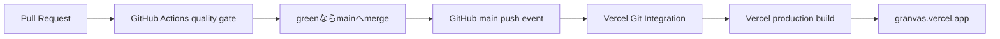

# Phase 15 Automatic Vercel Delivery 設計

> 作成日: 2026-08-15
> ステータス: 承認済み
> 関連要求: `requirements.md`
> Issue: [#37](https://github.com/dayaa-arch/granvas/issues/37)

## 1. 現状と原因

`.github/workflows/quality.yml`はPRと`main` pushでbuildを含むquality gateを実行するが、artifactをVercelへ公開しない。ADR-0006と永続文書もVercelを承認済み手動操作として定義している。このためPR #35が`main`へマージされても、Production Deploymentは作成されず、live URLは古いassetを配信し続けた。

## 2. 採用方式

Vercel Projectのnative Git IntegrationをGitHub repositoryへ接続する。

- GitHub Actionsは検証のみを担当する。
- Vercel Git Integrationが`main` pushを検知し、Vercel側のProject権限でbuild / deployする。
- Repositoryへ`VERCEL_TOKEN`、`VERCEL_ORG_ID`、`VERCEL_PROJECT_ID`を保存しない。
- Production BranchはGitHub default branchと同じ`main`に固定する。
- build contractは既存`vercel.json`の`bun run build` / `dist`を継続利用する。

## 3. 実行手順

1. Vercel CLIを認証し、既存の`granvas.vercel.app`を所有するProjectを特定する。
2. local repositoryをそのexisting Projectへlinkする。重複Projectは作らない。
3. Projectを`https://github.com/dayaa-arch/granvas.git`へ`vercel git connect`で接続する。
4. Project設定からProduction Branchが`main`であることを確認する。
5. Git接続時にcurrent `main` deploymentが開始されない場合だけ、review済み`main`を明示的にProductionへdeployする。
6. live URLでPhase 14の一時保存を検証する。
7. 文書変更PRを作成し、quality gateがgreenなら`main`へmergeする。
8. merge commitをsourceとするProduction Deploymentが自動作成されることを確認する。
9. deployment `READY`、production alias、live smoke / reload / storage / CSP / outboundを再確認する。

## 4. セキュリティ設計

- GitHub Actionsへlong-lived Vercel tokenを置かない。
- Vercel認証情報をcommand output、Issue、PR、commitへ記録しない。
- `.vercel/`はlocal metadataとしてgitignore状態を維持する。
- GitHub Appにはrepository連携に必要なVercel側権限だけを使用する。
- application runtimeにはVercel SDK、environment variable、remote APIを追加しない。
- `connect-src 'none'`とasset load後outbound 0を維持する。

## 5. Failure / Rollback

- Vercel認証またはGitHub App権限が不足する場合は、Project設定を推測で変更せずユーザーへ認証操作を依頼する。
- existing Projectを特定できない場合は新規Projectを作らず停止する。
- Production buildが失敗した場合はaliasを変更せず、build logを診断する。
- 自動deploymentが確認できない場合はPRをmerge済みのまま原因を調査し、GitHub Actions deploymentへ切り替えない。
- live regressionがあればVercelの直前Production Deploymentへrollbackできることを確認する。

## 6. 文書への影響

- 新規`docs/adr/0008-automatic-vercel-production-delivery.md`: ADR-0006のVercel手動公開部分を更新する決定。
- `docs/adr/README.md`: ADR-0008索引。
- `docs/GRANVAS_SPEC_v0.1.md`: deployment contract、改訂履歴、Phase 15。
- `docs/architecture.md`: Runtime / DeploymentとQuality CIの責務分離。
- `docs/product-requirements.md`: distribution requirement。
- `docs/functional-design.md`: production delivery flow。
- `docs/repository-structure.md`: repository workflowとexternal Git Integrationの境界。
- `docs/development-guidelines.md`: merge後のdeployment / live verification規則。
- `docs/development-roadmap.md`: Phase 15と実行順。
- `docs/glossary.md`: Production Branch / Vercel Git Integration。
- `docs/ideas/initial-requirements.md`: hosting運用要求。
- `README.md` / `AGENTS.md`: maintainer向けの公開contract。

## 7. Code / Infrastructureへの影響

- application source code、Domain、Application、Context contractは変更しない。
- `.github/workflows/quality.yml`は変更しない。
- `vercel.json`は既存のbuild、output、rewrite、security header contractを維持し、変更不要を想定する。
- `.gitignore`へ`.vercel`を追加し、CLIが生成するProject metadataをcommit対象外にする。
- 永続的な実装変更はVercel ProjectのGit connection / Production Branchというexternal infrastructure stateである。

## 8. 検証設計

### Local / CI

- `bun run typecheck`
- `bun run lint`
- `bun run test:run`
- `bun run build`
- `bun run release:verify`
- `bun run docs:build`
- `bun run licenses:verify`
- `bun audit --audit-level=high`
- `bun run test:performance`
- `bunx playwright test`

### Vercel / Live Browser

- deployment source repository / branch / commitをinspectする。
- deployment stateが`READY`で、`granvas.vercel.app` aliasが付くことを確認する。
- live UIの`24時間一時保存`を確認する。
- Textを変更し、localStorage key`granvas:temporary-project:v1`の作成とreload復元を確認する。
- direct access / reloadがHTTP 200でSPA entryへ解決されることを確認する。
- CSP headerを確認する。
- asset load後の編集操作でunexpected outbound requestがないことを確認する。

## 9. Architecture原則

このPhaseはdelivery infrastructureだけを変更し、Context / Layerへ新しい依存を追加しない。Git IntegrationはVercel ProjectとGitHub repositoryの外部境界に限定され、Domain / Application / Presentation / browser runtimeから参照されないため、SRP、一方向依存、疎結合、DIPを維持する。

## 10. Current mainのProduction反映実績

2026-08-15に、existing Vercel Project `granvas`をGitHub repository `dayaa-arch/granvas`へ接続し、Production Branchが`main`であることをVercel APIで確認した。current review済み`main`のcommit `8871a5a724fd8303095f21271cc9011660075af0`からProduction Deployment `dpl_BCaczBDndKMYfUywLgxAt9XMbeEg`を作成し、`READY` / `PROMOTED`、`granvas.vercel.app` aliasを確認した。

live browserではTextを編集した直後に`一時保存済み（24時間）`とlocalStorage key `granvas:temporary-project:v1`を確認し、beforeunloadを承認してreloadした後も同じTextと`24時間の一時保存から作業を復元しました。`という通知を確認した。console error / warningは0件で、network requestは同一originの静的assetだけだった。HTTP 200、SPA reload、`connect-src 'none'`を含むCSP、`nosniff`、`no-referrer`も維持している。

PR #38を`main`へmergeした結果、merge commit `ba72fd7daac25c7d3d16a9fa9a4d914079803516`をsourceとするProduction Deployment `dpl_3iWKMJhf6psHF5Td8b99W9Qb71WX`が追加のdeploy操作なしに自動作成された。deploymentは`source: git`、branch `main`、`READY` / `PROMOTED`となり、約5秒で`granvas.vercel.app` aliasへ反映された。

自動deployment後のlive browserでも、Text編集、`一時保存済み（24時間）`、localStorage record、reload後のText / Graph復元と復元通知を再確認した。console error / warningは0件、unexpected non-static requestは0件である。これによりGit Integration設定、current main公開、automatic delivery、live recoveryの全受け入れ条件を満たした。
