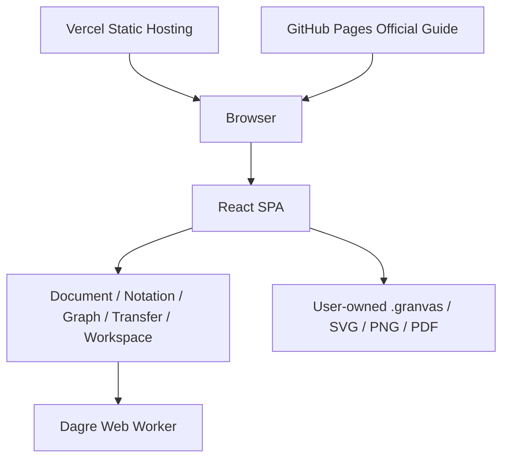

# Granvas 技術仕様書

> Status: Release Candidate
> Target: v0.1  
> Updated: 2026-08-14
> Related: `docs/adr/`

## 1. Architecture Summary

Granvas v0.1は、Vercelで配信するclient-onlyのReact SPAである。Domain-Driven Design、Layered Architecture、Modular Monolithを採用し、TextからGraphへのprojection、24時間のbrowser内一時復旧、ユーザー所有fileによる恒久保存をbrowser内で完結させる。

日本語の公式利用ガイドはproduct SPAとは別の静的artifactとしてGitHub Pagesへ配信する。公式Docsはproduct runtimeやContextへ接続せず、Vercel hosting方針を変更しない。



## 2. Technology Stack

| Area | Technology | Policy |
| --- | --- | --- |
| Language | TypeScript 6 | strict modeを維持する |
| UI | React 19 | presentation内に限定する |
| Build | Vite 8 | static SPAを生成する |
| Package manager | Bun 1.3系 | `bun.lock`をcommitする |
| Editor | CodeMirror 6 | Notation presentationで隔離する |
| Graph rendering | `@xyflow/react` 12 | Graph presentationで隔離する |
| Layout | `@dagrejs/dagre` 3 | Graph infrastructureのWorker adapterで隔離する |
| PDF generation | `pdf-lib` 1.17 | Transfer infrastructureからPDF選択時だけdynamic importする |
| Unit / Component test | Vitest 4 / React Testing Library | domain・application・presentationを分離してtestする |
| E2E | Playwright | Chromium / Firefox / WebKitを対象にする |
| Hosting | Vercel | static deployment、server functionなし |
| Documentation hosting | GitHub Pages | `gh-pages` branch rootから静的利用ガイドを公開する |

PDF生成は[ADR-0005](adr/0005-pdf-generation-with-pdf-lib.md)に従い、Canvas PNGを`pdf-lib`でsingle-page PDFへ埋め込む。

## 3. Runtime / Deployment

- production artifactはViteの静的buildとする。
- Vercelはasset配信とsecurity header設定だけを担当する。
- API Route、Serverless Function、Edge Function、database connectionを作成しない。
- SPAのdirect access / reloadがindex entryへ解決されるようVercel routingを設定する。
- production asset load後のoutbound requestは0とする。
- secretを必要とするruntime機能はv0.1に存在しない。

### 3.1 Official Documentation Deployment

- main branchの`docs-site/`を公式利用ガイドのsourceとする。
- build artifactはproject Pagesのbase path `/granvas/`を使用する。
- review済みmainから生成したartifactだけを`gh-pages` branch rootへ配置する。
- rootへ`.nojekyll`を含め、GitHub Pagesのlegacy branch sourceとして公開する。
- repositoryのGitHub Actionsはquality verificationだけを行う。custom Pages deployment workflowは追加せず、Pages platformの内部deploymentと区別する。
- official Docsはruntime backend、analytics、tracking、remote font、cookieを使用しない。
- product SPAのVercel deploymentとDocsのGitHub Pages deploymentを相互依存させない。

### 3.2 Quality CI

- `.github/workflows/quality.yml`はpull request / main pushでfrozen Bun install、typecheck、lint、unit / component、app / Docs build、audit、three-browser E2E、performanceを検証する。
- deployment job、repository write permission、Vercel / Pages credentialを含めない。
- Vercel productionとPagesはreview済みmainを承認済み手動操作で公開する。

## 4. Bounded Context

| Context | Responsibility | Depends on other context internals |
| --- | --- | --- |
| Document | active source、revision、dirty lifecycle、短期復旧contract | No |
| Notation | parser、diagnostics、SourceRange / spans、編集規則 | No |
| Graph | semantic graph、layout、export scene | No |
| Transfer | Import / Download、format生成 | No |
| Workspace | published application APIの協調、Graph編集のorchestration | Public contracts only |

App / Composition Rootが具象adapterとpublic presentation componentを結線する。

## 5. Layered Architecture

各Contextは必要な範囲で以下を持つ。

```text
presentation → application → domain
                     ↑
infrastructure ──────┘
```

### 5.1 Domain

- Granvas固有の不変条件、value、pure functionを所有する。
- React、DOM、browser API、CodeMirror、React Flow、Dagreをimportしない。
- 他Contextのdomainをimportしない。

### 5.2 Application

- use case、port、immutable DTO、transaction境界を所有する。
- infrastructure具象をimportしない。
- Workspaceだけが他Contextのpublished application contractを利用できる。
- browser固有型やSDK型をpublic signatureへ出さない。

### 5.3 Infrastructure

- application portを実装する。
- Browser File API、Blob、Canvas、Worker、Dagre、PDF libraryなどの具象を閉じ込める。
- 外部型をmodule DTOへ変換して返す。

### 5.4 Presentation

- UI framework、event、ViewModel変換を所有する。
- domain entityを直接描画しない。
- 他moduleのpresentation内部をimportしない。
- Appだけが各moduleのpublic presentation APIを合成する。

## 6. Architecture Principles

### 6.1 Domain Boundary

- `src/modules/<context>/index.ts`だけをcontext外へ公開する。
- deep importをESLint `no-restricted-imports`で禁止する。
- `shared`はcontext-independentなUI・結果型・基盤だけに限定する。
- `SourceRange`はNotationが所有し、Graph Domainへ入れない。

### 6.2 Single Responsibility

- Documentはfile I/Oを行わない。
- TransferはDocumentやGraphのlifecycleを管理しない。
- GraphはText位置を管理しない。GraphはNotationの文法を知らない。
- Workspaceはsyntaxやlayout algorithmを実装しない。Notation記法の文字列を組み立てない。
- Presentationは編集規則を持たない。受け取った編集列をUI frameworkのtransactionへ変換するだけとする。

### 6.3 One-way Dependency

- domainからapplication / infrastructure / presentationへの逆流を禁止する。
- applicationからinfrastructure具象への依存を禁止する。
- Workspace以外のcontext間依存を禁止する。
- Appは結線だけを行い、domain ruleを持たない。

### 6.4 Loose Coupling

- Context間ではDTO / facadeだけを渡す。
- React Flow Node、Dagre Graph、EditorView、FileSystemHandle、AbortSignal、Supabase型をpublic contractに出さない。
- ExportはDOM snapshotではなく`GraphExportSceneDto`を入力とする。

### 6.5 Dependency Inversion

| Port | Defined in | Implemented in |
| --- | --- | --- |
| `GraphLayoutPort` | `graph/application/ports` | `graph/infrastructure` |
| `ProjectFilePickerPort` | `transfer/application/ports` | `transfer/infrastructure` |
| `FileDownloadPort` | `transfer/application/ports` | `transfer/infrastructure` |
| `GraphExportPort` | `transfer/application/ports` | `transfer/infrastructure` |
| `TemporaryProjectStoragePort` | `document/application/ports` | `document/infrastructure/browser` |

具象は`src/app/bootstrap/createApplication.ts`で生成し、constructorまたはfactory argumentで注入する。

## 7. Projection Concurrency

- `documentRevision`はsource更新ごとに単調増加する。
- ParseResult、ThoughtGraph、PositionedGraph、SourceMap、Diagnosticsはrevisionを持つ。
- new revision開始時にold layoutをframework-neutralな`CancellationSignal`でcancelする。
- adapterは内部で`AbortController`やWorker messageへ変換してよい。
- completion後もcurrent revisionと一致しない結果を破棄する。
- Graph / SourceMap / Diagnosticsを異なるrevisionから合成しない。

## 8. Layout Architecture

- Semantic Graphは座標を持たない。
- Node layout boundsはv0.1で240 × 88 CSS pixels。
- Dagre input orderはoccurrence key順へ正規化する。
- DagreはWeb Worker内で実行する。
- outputの`x/y`はNode左上座標。
- Group boundsはmember配置後に24px paddingで計算する。
- 複数Group所属は重なり可能なoverlayとして表示し、React Flow `parentId`を使用しない。
- `certainty`はlayoutに影響しない。`rejected`なNodeも他と同じboundsを占める。確信度は表示の差であり配置の差ではない。
- **座標はどこにも永続化しない。** ユーザーがNodeをドラッグしても位置を保存せず、ドロップ先が何であったかだけを意味として解釈する（[ADR-0001](adr/0001-semantic-node-drag-without-coordinate-persistence.md)）。

## 9. Source Editing Architecture

Graph側の操作をTextへ書き戻す経路の設計。根拠は[ADR-0002](adr/0002-source-edit-plan-as-notation-domain-concern.md)。

- ドキュメントには通常文が混在するため、**Graphからテキスト全文を再生成しない**。すべての操作は現在sourceへの最小編集列へ変換する。
- 編集規則はNotation domainの`(source, parseResult, command) → SourceEditPlan`というpure functionとして所有する。
- `SourceEditPlan`はReact / CodeMirror / React Flow / DOM / browser APIを参照しない。
- 編集列は適用前sourceを基準とし、`from`昇順で重複しない。
- 実行できない操作は例外ではなく理由付きの`rejected`として返す。
- ParserはNode / Relation / Groupのtoken単位`spans`を公開する。これがなければラベルだけの置換や`@id`だけの挿入を表現できない。
- Graph IDからoccurrence keyへの逆引きは`ProjectionSourceMapDto`の`*Keys`を経由する。Graph IDの生成規則を他Contextで再現しない。
- Presentationは編集列を1トランザクションでdispatchし、Undo 1回で戻せる状態にする。全文置換の経路はImport専用に分離する。
- Graph編集はdebounceせず、開始前にpendingなsource更新をflushする。

最も強い契約は**round-trip**である。「planを適用したsourceを再parseすると意図した構造になる」ことと「通常文と無関係な行が一切変化しない」ことをtestで保証する。

## 10. File Architecture

### 10.0 Temporary Browser Recovery

- versioned key`granvas:temporary-project:v1`へProject name、Text source、dirty flag、保存時刻、失効時刻だけをJSON保存する。
- TTLは最後のwrite成功から24時間。expired / corrupt / unknown schemaは復元せず削除する。
- Graph、座標、projection、diagnostics、selection、Undo履歴、runtime revisionは保存しない。
- Application serviceがschema / TTL / failure normalization、Infrastructure adapterがlocalStorage I/O、Workspaceが保存timingを担当する。
- browser storage failureは一時保存状態へ反映し、Document / projection / Import / Downloadを失敗させない。
- 一時保存は`.granvas` clean baselineを変更しない。


### 10.1 `.granvas`

- UTF-8 plain text。
- active source以外を含めない。
- BOMはDownload時に付与しない。
- Import時は先頭BOMを除去し、改行を保持する。
- hard limitは5 MiB。

### 10.2 Visual Formats

- SVG / PNG / PDFはcurrent valid projectionの派生成果物。
- full graph boundsと24px paddingを使用する。
- untrusted textを各formatのsinkでescapeする。
- Node / Edgeのcertaintyを線種、太さ、badge、打ち消し線で表し、colorだけに依存しない。
- PNGは2xを基本とし8192 × 8192を上限とする。
- PNGは自己完結SVGをwhite backgroundのCanvasへ描画して生成し、上限縮小時はnoticeを返す。
- PDFは同じCanvas PNGを`pdf-lib`で埋め込み、single-page、graph boundsに合わせたpage size（1 CSS px = 0.75pt）とする。

## 11. Security / Privacy

- production asset load後のoutbound requestは0。
- telemetry、remote API、cloud storageなし。
- active Textは同一originのlocalStorageへ最大24時間だけ保存し、networkへ送信しない。
- browser storageのJSONをuntrusted inputとしてschema / TTL検証する。
- notationを実行しない。`eval`とdynamic code executionを禁止する。
- source由来文字列に`dangerouslySetInnerHTML`を使用しない。
- file nameはpath separator、control character、予約文字を除去する。
- Vercel responseへCSPを設定する。
- dependency追加時はlicense、supply-chain、bundle sizeをreviewする。
- official Docsへthird-party script、tracking pixel、remote font、form送信を追加しない。
- Pages artifactへ`.steering/`、engineering `docs/`、secret、local pathを混入させない。

最低限のproduction CSP:

```text
object-src 'none'
base-uri 'none'
frame-ancestors 'none'
connect-src 'none'
```

完全なdirectiveはViteのasset形式とWorker動作を確認して`vercel.json`へ定義する。

## 12. Performance

基準fixture: 500 lines、200 nodes、300 edges、10 groups、label 200 UTF-16 code units以下。

| Metric | Target |
| --- | --- |
| input → next paint | p95 ≤ 50ms |
| Parser | p95 ≤ 50ms |
| Layout Worker round trip | p95 ≤ 200ms |
| debounce end → Graph paint | p95 ≤ 350ms |
| pan / zoom long task | 100ms超なし |
| `SourceEditPlan`生成 | p95 ≤ 20ms |
| Graph編集の確定 → Graph paint | p95 ≤ 350ms |

projection rebuildの既定debounceは120ms。Graph編集はdebounceしない。基準を満たせない場合はParserもWorkerへ移す。

## 13. Browser / Accessibility

- PlaywrightのChromium / Firefox / WebKitで主要E2Eを実行する。
- minimum viewportは960px、recommendedは1280px以上。
- WCAG 2.2 AAを適合目標とする。
- keyboard-only navigationとfocus managementをrelease gateにする。
- official Docsはsemantic HTML、skip link、heading hierarchy、画像alt、focus indicator、responsive navigationを備える。

## 14. Future Authentication

将来の認証providerは **Supabase Auth** に決定済みである。実装時は`identity` Contextを新設し、provider portをapplication、Supabase adapterをinfrastructureへ置く。

v0.1では以下を禁止する。

- Supabase SDK dependency。
- Supabase URL / keyなどの環境変数。
- sign-in / sign-up UI。
- session persistence。
- protected route。
- Supabase database / storage / realtimeの暗黙採用。

## 15. Development Commands

```bash
bun install
bun run dev
bunx tsc -b
bunx eslint .
bun run test:run
bunx playwright test
bun run build
```

## 16. Required ADR

ADRは`docs/adr/`に置き、`docs/adr/README.md`を索引とする。

記録済み:

- [ADR-0001](adr/0001-semantic-node-drag-without-coordinate-persistence.md) Semantic node drag without coordinate persistence。
- [ADR-0002](adr/0002-source-edit-plan-as-notation-domain-concern.md) Source edit plan as a Notation domain concern。
- [ADR-0003](adr/0003-certainty-markers-in-granvas-notation.md) Certainty markers in Granvas Notation。
- [ADR-0004](adr/0004-official-documentation-on-github-pages.md) Official documentation on GitHub Pages。
- [ADR-0005](adr/0005-pdf-generation-with-pdf-lib.md) PDF generation with pdf-lib。
- [ADR-0006](adr/0006-promote-official-documentation-to-complete-edition.md) Promote official documentation to complete edition。
- [ADR-0007](adr/0007-temporary-browser-project-recovery.md) Temporary browser project recovery。

未起票:

- 既定Node sizeまたはmeasure-first layoutの変更。
- ParserをWeb Workerへ移す判断。
- State management library導入。
- Node座標永続化を再検討する場合のADR-0001 supersede。
- Supabase Auth実装開始時のidentity boundaryとsession policy。
