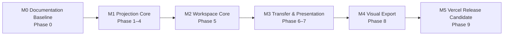

# Granvas 開発ロードマップ

> Status: Active
> Target: v0.1
> Updated: 2026-08-11
> Phase Source of Truth: この文書

## 1. 目的と用語

Granvas v0.1の仮説「文章を書く行為と、思考構造を見る行為を一つの連続した体験にできるか」を、検証可能な実装単位へ分割する。

- **Milestone**: 複数Phaseを束ねるrelease-level checkpoint。M0〜M5で表す。
- **Phase**: 原則として1つのsteering、Issue、PRで完結する実装・検証単位。Phase 0〜9で表す。
- **Task**: Phase内の具体的な作業項目。初回実装タスクリストの番号を独立したPhase番号として解釈しない。

Phaseの名称、順序、進捗はこの文書を正本とする。完了済みsteering、Issue、PRは履歴であるため改名せず、本書の対応表から追跡する。

## 2. Release Milestones

| Milestone | 対象Phase | Exit |
| --- | --- | --- |
| M0 Documentation Baseline | Phase 0 | 要求、仕様、基本設計、開発規約が承認済み |
| M1 Projection Core | Phase 1〜4 | Textから決定的なPositioned Graphを生成可能 |
| M2 Workspace Core | Phase 5 | revision整合性とText / Graph往復がapplication contractで成立 |
| M3 Transfer & Presentation | Phase 6〜7 | browser上で編集、投影、`.granvas`保存・再開、SVG共有が可能 |
| M4 Visual Export | Phase 8 | SVG / PNG / PDFへfull Graphを出力可能 |
| M5 Vercel Release Candidate | Phase 9 | DoD、OSS、品質、production検証をすべて完了 |

## 3. Phase Status / History

| Phase | 名称 | 状態 | Steering | Issue / PR |
| --- | --- | --- | --- | --- |
| 0 | Documentation Baseline | 完了 | `.steering/20260810-initial-implementation/` | baselineは[PR #2](https://github.com/dayaa-arch/granvas/pull/2)に包含 |
| 1 | Foundation | 完了 | `.steering/20260810-phase-1-foundation/` | [Issue #1](https://github.com/dayaa-arch/granvas/issues/1) / [PR #2](https://github.com/dayaa-arch/granvas/pull/2) |
| 2 | Document Context | 完了 | `.steering/20260810-phase-2-document-context/` | [Issue #5](https://github.com/dayaa-arch/granvas/issues/5) / [PR #6](https://github.com/dayaa-arch/granvas/pull/6) |
| 3 | Notation Core | 完了 | `.steering/20260810-phase-3-notation-core/` | [Issue #7](https://github.com/dayaa-arch/granvas/issues/7) / [PR #8](https://github.com/dayaa-arch/granvas/pull/8) |
| 4 | Graph Core | 完了 | `.steering/20260810-phase-4-graph-core/` | [Issue #9](https://github.com/dayaa-arch/granvas/issues/9) / [PR #10](https://github.com/dayaa-arch/granvas/pull/10) |
| 5 | Workspace Core | 完了 | `.steering/20260810-phase-5-workspace-core/` | [Issue #11](https://github.com/dayaa-arch/granvas/issues/11) / [PR #12](https://github.com/dayaa-arch/granvas/pull/12) |
| 6 | Transfer Core | 完了 | `.steering/20260810-phase-6-transfer-core/` | [Issue #13](https://github.com/dayaa-arch/granvas/issues/13) / [PR #14](https://github.com/dayaa-arch/granvas/pull/14) |
| 7 | Presentation Shell | 完了 | `.steering/20260810-phase-7-presentation-shell/` | [Issue #15](https://github.com/dayaa-arch/granvas/issues/15) / [PR #16](https://github.com/dayaa-arch/granvas/pull/16) |
| 8 | Visual Export | 未着手 | 作業開始時に新規作成 | 未起票 |
| 9 | Release Hardening | 未着手 | 作業開始時に新規作成 | 未起票 |

現在の完了地点は**Phase 7 Presentation Shell**である。次の実装Phaseは**Phase 8 Visual Export**とする。GitHub Actionsはユーザー指示により後回しとし、Phase 9の未完了項目として保持する。

## 4. Phase 0: Documentation Baseline

Goal: 実装判断の基準とmodule boundaryを確定する。

Deliverables:

- [x] `docs/ideas/initial-requirements.md`。
- [x] 永続文書7点と`docs/GRANVAS_SPEC_v0.1.md`。
- [x] `AGENTS.md`と初回実装steering。
- [x] Product scope、file persistence、hosting、future auth decisionの整合。
- [x] Context / layer / port、Parser recovery、SourceRange、identity、revision、Group contractの決定。
- [x] ユーザー承認。

## 5. Phase 1: Foundation

Goal: architecture ruleを機械的に守れる開発基盤を作る。

Deliverables:

- [x] Vite / React / TypeScript / Bunとcomposition root。
- [x] path alias、ESLint boundary rule、Vitest、React Testing Library、Playwright。
- [x] Chromium / Firefox / WebKit設定。
- [x] Vercel static SPA設定とproduction CSP contract。
- [x] typecheck、lint、test、build、3-browser E2E。

## 6. Phase 2: Document Context

Goal: active source、revision、clean baseline、dirty / exporting / error lifecycleをframework非依存で管理する。

Deliverables:

- [x] `GranvasDocument`とimmutable transition。
- [x] Create / Update / Replace / project Download lifecycle API。
- [x] stale completion、failure、編集競合のtest。
- [x] storage / browser依存を持たないpublished contract。

## 7. Phase 3: Notation Core

Goal: Granvas Notation v0.1をexecutable specificationとして実装する。

Deliverables:

- [x] line scanner、candidate classifier、indentation / Group scope state machine。
- [x] Node / Relation / Group / Layout parserとdocument-wide resolver。
- [x] DiagnosticDto、recovery、UTF-16 SourceRange、deterministic occurrence key。
- [x] canonical / invalid / Unicode / CRLF / BOM fixtures。
- [x] current source以外の構造を混在させないpure application contract。

## 8. Phase 4: Graph Core

Goal: Notation DTOからframework-independentなGraphと決定的Layoutを生成する。

Deliverables:

- [x] `ThoughtGraph` / Node / Edge / Groupとdeterministic mapping。
- [x] fixed Node bounds、`GraphLayoutPort`、CancellationSignal。
- [x] Dagre Web Worker adapterとlatest result guard。
- [x] Group overlay boundsと`GraphExportSceneDto`。
- [x] duplicate ID、multiple Group membership、parallel Edge、layout performanceのtest。

## 9. Phase 5: Workspace Core

Goal: published application APIを協調し、revision整合性とText / Graph selectionを成立させる。

Deliverables:

- [x] Document → Notation → Graph → Layout pipeline。
- [x] revision propagation、cancellation、latest-wins commit guard。
- [x] `ProjectionSourceMapDto`とselection mapping。
- [x] dirty confirmation付きProject replacement。
- [x] project / visual Download input assemblyとasync race test。

## 10. Phase 6: Transfer Core

Goal: Project Import / Downloadとvisual exportのframework-neutral contractを確立する。

Deliverables:

- [x] Download format、file name、MIME、PNG上限policy。
- [x] `.granvas` extension / 5 MiB / strict UTF-8 / BOM validation。
- [x] Project picker、Blob download、Graph export ports。
- [x] `.granvas` Download / Import round-trip。
- [x] SVG exporter、XML escaping、XSS / failure contract test。

Actual Canvas PNG生成とPDF生成はPhase 8へ分離する。

## 11. Phase 7: Presentation Shell

Goal: TextとGraphを往復できるdesktop-first Web editorを完成させる。

Deliverables:

- [x] Top Bar、SplitPane、StatusBar、Download Dialog。
- [x] CodeMirror editor、syntax highlight、diagnostic gutter、IME対応。
- [x] read-only React Flow Graph、Group overlay、Pan / Zoom / Fit View。
- [x] Text ↔ Graph selectionとkeyboard activation。
- [x] Import、`.granvas` / SVG Download、dirty warning。
- [x] component / accessibility testと3-browser E2E。

## 12. Phase 8: Visual Export

Goal: current valid projectionのfull Graphを共有可能な全visual formatへ安全に出力する。

Deliverables:

- [ ] Canvas PNG exporterと2x / 8192px上限通知。
- [ ] PDF generation library ADR。
- [ ] single-page、white background、graph bounds page sizeのPDF exporter。
- [ ] SVG / PNG / PDFがNode、Edge、Group、relation labelを含むことのcontract test。
- [ ] visual Download成功・失敗のいずれでもProjectのdirty stateを変更しないことのtest。
- [ ] SVG / PNG / PDF full-graph Download E2E。

Exit Criteria:

- [ ] SVG / PNG / PDFへviewport非依存のfull Graphを出力できる。
- [ ] untrusted labelが各formatで実行・解釈されない。
- [ ] PNG制限とPDF page boundsが仕様どおりである。
- [ ] 生成・download失敗時にcurrent sourceとdirty stateを維持する。

## 13. Phase 9: Release Hardening

Goal: OSSとしてVercel上で安全かつ再現可能に利用できるrelease candidateを作る。

Deliverables:

- [ ] 500 lines / 200 nodes / 300 edges / 10 groupsのperformance benchmark。
- [ ] input paint、Parser、layout、Graph paintのp95検証。
- [ ] keyboard-only E2EとWCAG 2.2 AA自動検査。
- [ ] CSP、outbound request、bundle dependencyのsecurity検証。
- [ ] canonical example、CONTRIBUTING、SECURITY、OSS license。
- [ ] typecheck / lint / test / build / E2E用GitHub Actions（後回しの明示指示あり）。
- [ ] Vercel production deployment、direct access / reload検証。
- [ ] `docs/GRANVAS_SPEC_v0.1.md`のDefinition of Done完了。

Exit Criteria:

- [ ] localとCIの全quality gateがgreen。
- [ ] productionでruntime outbound requestがない。
- [ ] Vercel production URLでcanonical demoとDownload / Importが動作する。
- [ ] v0.1 Definition of Doneをすべて満たす。

## 14. Known Risks

| Risk | Impact | Mitigation |
| --- | --- | --- |
| Group overlayとDagre配置の不整合 | GroupがNodeを囲めない | member配置後にboundsを計算し、layoutにはGroup parentを使わない |
| 連続入力によるstale layout | TextとGraphが不一致 | revision、cancel、commit前check |
| PDF libraryのbundle増加 | 初期load悪化 | ADRでbundle / vector / license比較、lazy load検討 |
| 大きなImportでUI停止 | data loss / poor UX | 5 MiB hard limit、Worker、validation first |
| `.granvas` Download忘れ | Project喪失 | dirty indicator、Import/New/leave warning |
| Export文字列によるinjection | XSS / corrupt file | framework-neutral scene、sink別escape、CSP |

## 15. Deferred Work

- Graph → Text双方向編集。
- Node座標永続化。
- multi-document workspace、folder、search、backlink。
- account / authentication implementation。
- cloud sync / collaboration。
- AI / plugin / mobile / desktop app。

認証実装を開始する場合のproviderはSupabase Authに決定済みだが、roadmapへの追加はv0.1完了後に別steering / ADRで行う。

## 16. Phase運用規則

- 新しいPhase名と番号は、実装開始前にこの文書へ記載する。
- steering directory、Issue、branch、PRのtitleは本書のPhase名と一致させる。
- 完了済み履歴は改名せず、対応表を更新して追跡可能性を維持する。
- Phase完了時はstatus表、対象Phaseのcheckbox、初回実装タスクリストを同じPRで更新する。
