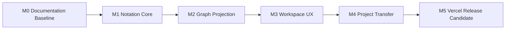

# Granvas 開発ロードマップ

> Status: Draft / Approval Candidate  
> Target: v0.1  
> Updated: 2026-08-10

## 1. 目的

Granvas v0.1の仮説「文章を書く行為と、思考構造を見る行為を一つの連続した体験にできるか」を、段階的に検証可能なincrementへ分割する。

## 2. Release Milestones

## 3. Phase 0: Documentation Baseline

Goal: 実装判断の基準とmodule boundaryを確定する。

Deliverables:

- `docs/ideas/initial-requirements.md`
- 永続文書7点。
- `docs/GRANVAS_SPEC_v0.1.md`のreview指摘反映。
- `AGENTS.md`。
- `.steering/20260810-initial-implementation/`。
- PDF generation libraryを除くv0.1技術選択。

Exit Criteria:

- [ ] Product scope、file persistence、hosting、future auth decisionが文書間で一致する。
- [ ] Context / layer / portの定義場所と実装場所が一致する。
- [ ] Parser recovery、SourceRange、identity、revision、Group contractが決定済み。
- [ ] ユーザーが文書一式を承認する。

## 4. Phase 1: Project Bootstrap

Goal: architecture ruleを機械的に守れる開発基盤を作る。

Tasks:

- Vite / React / TypeScript / Bun設定整理。
- path alias。
- ESLint boundary rule。
- Vitest / React Testing Library / Playwright設定。
- Context directory skeleton。
- App / Bootstrap composition root。
- Vercel static deploymentとproduction CSPの最小構成。

Exit Criteria:

- [ ] `bunx tsc -b`、`bunx eslint .`、`bun run test:run`、`bun run build`が成功する。
- [ ] forbidden deep importをCIで検出できる。
- [ ] Vercel previewでSPA direct access / reloadが動作する。

## 5. Phase 2: Notation Core

Goal: Granvas Notation v0.1をexecutable specificationとして実装する。

Tasks:

- candidate classifier。
- indentation / Group scope state machine。
- Node / Relation / Group / Layout parser。
- document-wide reference resolution。
- DiagnosticDtoとcode別recovery。
- UTF-16 SourceRange。
- deterministic occurrence key。
- canonical / error / Unicode fixtures。

Exit Criteria:

- [ ] 仕様書4章の全必須caseをunit testで網羅する。
- [ ] current source以外の構造をpartial resultへ混在させない。
- [ ] emoji / CRLF / BOM fixtureのrangeが一致する。

## 6. Phase 3: Graph Core

Goal: Notation DTOからframework-independentなGraphと決定的Layoutを生成する。

Tasks:

- `ThoughtGraph` / Node / Edge / Group。
- Notation DTO → Graph mapping。
- SourceRangeをGraph Domainへ持ち込まないcontract。
- fixed Node bounds / label wrapping。
- `GraphLayoutPort`とCancellationSignal。
- Dagre Web Worker adapter。
- Group overlay bounds。
- `GraphExportSceneDto`。

Exit Criteria:

- [ ] same inputからsame graph / layoutを生成する。
- [ ] duplicate ID / multiple Group membership / parallel Edgeを表示できる。
- [ ] target fixtureでlayout p95 200ms以下。

## 7. Phase 4: Workspace / Presentation

Goal: TextとGraphを往復でき、連続入力でstale projectionを表示しない。

Tasks:

- Document revision / dirty lifecycle。
- Workspace projection pipeline。
- latest-wins / cancellation。
- `ProjectionSourceMapDto`。
- CodeMirror syntax / diagnostics integration。
- React Flow read-only view。
- Text ↔ Graph selection。
- SplitPane / StatusBar / viewport policy。
- keyboard navigation / accessibility。

Exit Criteria:

- [ ] Graph click / keyboard activationで宣言行へ移動する。
- [ ] Editor cursorからNodeをhighlightする。
- [ ] 古いlayoutがcurrent Graphを上書きしない。
- [ ] IMEで文字欠落や確定後のstale diagnosticが起きない。
- [ ] inputからGraph paintまでp95 350ms以下。

## 8. Phase 5: Project Transfer

Goal: ユーザーがProjectを所有し、保存・再開・共有できる。

Tasks:

- Transfer Contextとports。
- dirty confirmation / beforeunload。
- `.granvas` extension / size / UTF-8 validation。
- `.granvas` Download / Import round-trip。
- Download dialog / file name sanitization。
- SVG exporter。
- Canvas PNG exporter。
- PDF library ADRとPDF exporter。
- visual format full graph bounds。
- error / cancel / disabled states。

Exit Criteria:

- [ ] `.granvas` Download → Importで同じsourceとGraphへ復元できる。
- [ ] SVG / PNG / PDFへfull graphを出力できる。
- [ ] visual Downloadがdirtyを解除しない。
- [ ] Import / Download失敗時にcurrent sourceを維持する。
- [ ] source由来のXSS payloadがfile / UIで実行されない。

## 9. Phase 6: Release Hardening

Goal: OSSとしてVercel上で安全かつ再現可能に利用できるrelease candidateを作る。

Tasks:

- Chromium / Firefox / WebKit E2E 6scenario。
- performance benchmark。
- WCAG 2.2 AA自動検査とkeyboard E2E。
- CSP / outbound request verification。
- README、examples、CONTRIBUTING、SECURITY。
- OSS license decisionと`LICENSE`。
- GitHub Actions。
- Vercel production deployment。

Exit Criteria:

- [ ] `docs/GRANVAS_SPEC_v0.1.md`のDefinition of Doneをすべて満たす。
- [ ] test / typecheck / lint / build / E2Eがgreen。
- [ ] productionでruntime outbound requestがない。
- [ ] Vercel production URLでcanonical demoとDownload / Importが動作する。

## 10. Known Risks

| Risk | Impact | Mitigation |
| --- | --- | --- |
| Group overlayとDagre配置の不整合 | GroupがNodeを囲めない | member配置後にboundsを計算し、layoutにはGroup parentを使わない |
| 連続入力によるstale layout | TextとGraphが不一致 | revision、cancel、commit前check |
| PDF libraryのbundle増加 | 初期load悪化 | ADRでbundle / vector / license比較、lazy load検討 |
| 大きなImportでUI停止 | data loss / poor UX | 5 MiB hard limit、Worker、validation first |
| `.granvas` Download忘れ | Project喪失 | dirty indicator、Import/New/leave warning |
| Export文字列によるinjection | XSS / corrupt file | framework-neutral scene、sink別escape、CSP |

## 11. Deferred Work

- Graph → Text双方向編集。
- Node座標永続化。
- multi-document workspace、folder、search、backlink。
- account / authentication implementation。
- cloud sync / collaboration。
- AI / plugin / mobile / desktop app。

認証実装を開始する場合のproviderはSupabase Authに決定済みだが、roadmapへの追加はv0.1完了後に別steering / ADRで行う。
