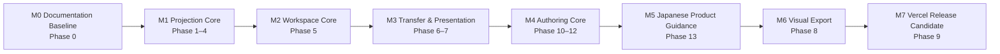

# Granvas 開発ロードマップ

> Status: Active
> Target: v0.1
> Updated: 2026-08-11
> Phase Source of Truth: この文書

## 1. 目的と用語

Granvas v0.1の仮説「文章を書く行為と、思考構造を見る行為を一つの連続した体験にできるか」を、検証可能な実装単位へ分割する。

- **Milestone**: 複数Phaseを束ねるrelease-level checkpoint。M0〜M7で表す。
- **Phase**: 原則として1つのsteering、Issue、PRで完結する実装・検証単位。Phase 0〜13で表す。
- **Task**: Phase内の具体的な作業項目。初回実装タスクリストの番号を独立したPhase番号として解釈しない。

Phaseの名称、順序、進捗はこの文書を正本とする。完了済みsteering、Issue、PRは履歴であるため改名せず、本書の対応表から追跡する。

**Phase番号は採番順であり、実行順ではない。** 実行順は§2のMilestoneと§3のstatus表に従う。Phase 10〜13はPhase 8〜9より後に採番されたが、先に実行する。

## 2. Release Milestones

| Milestone | 対象Phase | Exit |
| --- | --- | --- |
| M0 Documentation Baseline | Phase 0 | 要求、仕様、基本設計、開発規約が承認済み |
| M1 Projection Core | Phase 1〜4 | Textから決定的なPositioned Graphを生成可能 |
| M2 Workspace Core | Phase 5 | revision整合性とText / Graph往復がapplication contractで成立 |
| M3 Transfer & Presentation | Phase 6〜7 | browser上で編集、投影、`.granvas`保存・再開、SVG共有が可能 |
| M4 Authoring Core | Phase 10〜12 | 確信度を記法で表現でき、Graph操作がTextの最小差分として反映される |
| M5 Japanese Product Guidance | Phase 13 | 日本語UIと実装に一致する公式利用ガイドが公開される |
| M6 Visual Export | Phase 8 | SVG / PNG / PDFへfull Graphを出力可能 |
| M7 Vercel Release Candidate | Phase 9 | DoD、OSS、品質、production検証をすべて完了 |

## 3. Phase Status / History

| Phase | 名称 | 状態 | 実行順 | Steering | Issue / PR |
| --- | --- | --- | --- | --- | --- |
| 0 | Documentation Baseline | 完了 | 1 | `.steering/20260810-initial-implementation/` | baselineは[PR #2](https://github.com/dayaa-arch/granvas/pull/2)に包含 |
| 1 | Foundation | 完了 | 2 | `.steering/20260810-phase-1-foundation/` | [Issue #1](https://github.com/dayaa-arch/granvas/issues/1) / [PR #2](https://github.com/dayaa-arch/granvas/pull/2) |
| 2 | Document Context | 完了 | 3 | `.steering/20260810-phase-2-document-context/` | [Issue #5](https://github.com/dayaa-arch/granvas/issues/5) / [PR #6](https://github.com/dayaa-arch/granvas/pull/6) |
| 3 | Notation Core | 完了 | 4 | `.steering/20260810-phase-3-notation-core/` | [Issue #7](https://github.com/dayaa-arch/granvas/issues/7) / [PR #8](https://github.com/dayaa-arch/granvas/pull/8) |
| 4 | Graph Core | 完了 | 5 | `.steering/20260810-phase-4-graph-core/` | [Issue #9](https://github.com/dayaa-arch/granvas/issues/9) / [PR #10](https://github.com/dayaa-arch/granvas/pull/10) |
| 5 | Workspace Core | 完了 | 6 | `.steering/20260810-phase-5-workspace-core/` | [Issue #11](https://github.com/dayaa-arch/granvas/issues/11) / [PR #12](https://github.com/dayaa-arch/granvas/pull/12) |
| 6 | Transfer Core | 完了 | 7 | `.steering/20260810-phase-6-transfer-core/` | [Issue #13](https://github.com/dayaa-arch/granvas/issues/13) / [PR #14](https://github.com/dayaa-arch/granvas/pull/14) |
| 7 | Presentation Shell | 完了 | 8 | `.steering/20260810-phase-7-presentation-shell/` | [Issue #15](https://github.com/dayaa-arch/granvas/issues/15) / [PR #16](https://github.com/dayaa-arch/granvas/pull/16) |
| 10 | Notation Certainty | 完了 | 9 | `.steering/20260811-phase-10-notation-certainty/` | [Issue #19](https://github.com/dayaa-arch/granvas/issues/19) / [PR #20](https://github.com/dayaa-arch/granvas/pull/20) |
| 11 | Source Edit Core | 完了 | 10 | `.steering/20260811-phase-11-source-edit-core/` | [Issue #21](https://github.com/dayaa-arch/granvas/issues/21) / [PR #22](https://github.com/dayaa-arch/granvas/pull/22) |
| 12 | Graph Authoring | 完了 | 11 | `.steering/20260811-phase-12-graph-authoring/` | [Issue #23](https://github.com/dayaa-arch/granvas/issues/23) / [PR #24](https://github.com/dayaa-arch/granvas/pull/24) |
| 13 | Japanese UI & Official Documentation | 完了 | 12 | `.steering/20260811-phase-13-japanese-ui-official-documentation/` | [Issue #26](https://github.com/dayaa-arch/granvas/issues/26) / [PR #27](https://github.com/dayaa-arch/granvas/pull/27) / [PR #28](https://github.com/dayaa-arch/granvas/pull/28) |
| 8 | Visual Export | 完了 | 13 | `.steering/20260811-phase-8-visual-export/` | [Issue #29](https://github.com/dayaa-arch/granvas/issues/29) / [PR #30](https://github.com/dayaa-arch/granvas/pull/30) |
| 9 | Release Hardening | 実装中 | 14 | `.steering/20260811-phase-9-release-hardening/` | [Issue #31](https://github.com/dayaa-arch/granvas/issues/31) |

現在は**Phase 9 Release Hardening**を実行中である。Phase 8までの機能をproduct v0.1 Release Candidateとして監査し、GitHub Actions、OSS release files、performance / accessibility / security gate、Vercel production、公式Docs edition 1.0完全版を完成させる。

### 3.1 Scope Change: 2026-08-11

v0.1のscopeへ**Authoring Core（Phase 10〜12）を追加**し、Phase 8 / 9より先に実行する決定を行った。

背景: Phase 7完了時点のGranvasはText → Graphの一方向投影であり、記法の構文プリミティブはすべて既存の軽量記法（Mermaid / D2 / nomnoml / Argdown）に先行事例がある。この状態でreleaseすると、Granvasの説明が「Mermaid + 散文混在 + エラー耐性」で言い尽くされ、記法にも体験にも独自性が立たない。差別化の中核となる2点をrelease前に実装する。

1. 未確定・仮説を一級市民にする記法（Phase 10）。既存の軽量記法はすべて確定した構造を描く言語であり、ここは実際に空いている領域である。
2. Graph → Textの双方向編集（Phase 11〜12）。text-firstのツールでこれをやり切ったものはほぼ無い。

対応するADR:

- [ADR-0001 Semantic node drag without coordinate persistence](adr/0001-semantic-node-drag-without-coordinate-persistence.md)
- [ADR-0002 Source edit plan as a Notation domain concern](adr/0002-source-edit-plan-as-notation-domain-concern.md)
- [ADR-0003 Certainty markers in Granvas Notation](adr/0003-certainty-markers-in-granvas-notation.md)

Node座標の永続化は引き続き実装しない。ドラッグは座標ではなく意味（親子・Group所属・並び順）の操作として扱う。`Text is the source of truth`（仕様§1.2）と「座標を記法に保存しない」（仕様§2.3 / §4.7）は改訂しない。

### 3.2 Scope Change: 2026-08-11 — Japanese UI / Official Documentation

Phase 12完了後、製品UIを日本語へ統一し、その実装内容に一致する公式利用ガイドをGitHub Pagesへ公開するPhase 13を追加した。

- product applicationのtargetは引き続きv0.1とし、Phase 8 / 9未完了のrelease状態を変更しない。
- 公開siteは`Granvas 1.0 公式ドキュメント`の`公開プレビュー`とし、対応実装がv0.1開発版であることを明示する。
- product applicationはVercel、official DocsはGitHub Pagesとしてhostingを分離する。
- repositoryへcustom GitHub Actions workflowを追加せず、`gh-pages` branch rootをPages sourceとする。

決定の根拠は[ADR-0004](adr/0004-official-documentation-on-github-pages.md)。

## 4. Phase 0: Documentation Baseline

Goal: 実装判断の基準とmodule boundaryを確定する。

Deliverables:

- [x] `docs/ideas/initial-requirements.md`。
- [x] 永続文書7点と`docs/GRANVAS_SPEC_v0.1.md`。
- [x] `AGENTS.md`と初回実装steering。
- [x] Product scope、file persistence、hosting、future auth decisionの整合。
- [x] Context / layer / port、Parser recovery、SourceRange、identity、revision、Group contractの決定。
- [x] ユーザー承認。

## 5. Phase 1: Foundation

Goal: architecture ruleを機械的に守れる開発基盤を作る。

Deliverables:

- [x] Vite / React / TypeScript / Bunとcomposition root。
- [x] path alias、ESLint boundary rule、Vitest、React Testing Library、Playwright。
- [x] Chromium / Firefox / WebKit設定。
- [x] Vercel static SPA設定とproduction CSP contract。
- [x] typecheck、lint、test、build、3-browser E2E。

## 6. Phase 2: Document Context

Goal: active source、revision、clean baseline、dirty / exporting / error lifecycleをframework非依存で管理する。

Deliverables:

- [x] `GranvasDocument`とimmutable transition。
- [x] Create / Update / Replace / project Download lifecycle API。
- [x] stale completion、failure、編集競合のtest。
- [x] storage / browser依存を持たないpublished contract。

## 7. Phase 3: Notation Core

Goal: Granvas Notation v0.1をexecutable specificationとして実装する。

Deliverables:

- [x] line scanner、candidate classifier、indentation / Group scope state machine。
- [x] Node / Relation / Group / Layout parserとdocument-wide resolver。
- [x] DiagnosticDto、recovery、UTF-16 SourceRange、deterministic occurrence key。
- [x] canonical / invalid / Unicode / CRLF / BOM fixtures。
- [x] current source以外の構造を混在させないpure application contract。

## 8. Phase 4: Graph Core

Goal: Notation DTOからframework-independentなGraphと決定的Layoutを生成する。

Deliverables:

- [x] `ThoughtGraph` / Node / Edge / Groupとdeterministic mapping。
- [x] fixed Node bounds、`GraphLayoutPort`、CancellationSignal。
- [x] Dagre Web Worker adapterとlatest result guard。
- [x] Group overlay boundsと`GraphExportSceneDto`。
- [x] duplicate ID、multiple Group membership、parallel Edge、layout performanceのtest。

## 9. Phase 5: Workspace Core

Goal: published application APIを協調し、revision整合性とText / Graph selectionを成立させる。

Deliverables:

- [x] Document → Notation → Graph → Layout pipeline。
- [x] revision propagation、cancellation、latest-wins commit guard。
- [x] `ProjectionSourceMapDto`とselection mapping。
- [x] dirty confirmation付きProject replacement。
- [x] project / visual Download input assemblyとasync race test。

## 10. Phase 6: Transfer Core

Goal: Project Import / Downloadとvisual exportのframework-neutral contractを確立する。

Deliverables:

- [x] Download format、file name、MIME、PNG上限policy。
- [x] `.granvas` extension / 5 MiB / strict UTF-8 / BOM validation。
- [x] Project picker、Blob download、Graph export ports。
- [x] `.granvas` Download / Import round-trip。
- [x] SVG exporter、XML escaping、XSS / failure contract test。

Actual Canvas PNG生成とPDF生成はPhase 8へ分離する。

## 11. Phase 7: Presentation Shell

Goal: TextとGraphを往復できるdesktop-first Web editorを完成させる。

Deliverables:

- [x] Top Bar、SplitPane、StatusBar、Download Dialog。
- [x] CodeMirror editor、syntax highlight、diagnostic gutter、IME対応。
- [x] read-only React Flow Graph、Group overlay、Pan / Zoom / Fit View。
- [x] Text ↔ Graph selectionとkeyboard activation。
- [x] Import、`.granvas` / SVG Download、dirty warning。
- [x] component / accessibility testと3-browser E2E。

## 12. Phase 10: Notation Certainty

Goal: 未確定・仮説・棄却をNotationの一級市民として表現し、Text → Graphへ投影する。記法の追加のみを対象とし、Graph側からの操作はPhase 11以降で扱う。

決定の根拠は[ADR-0003](adr/0003-certainty-markers-in-granvas-notation.md)。

Deliverables:

- [x] Node確信度マーカー`[?type]` / `[!type]` / `[~type]`のscanと`certainty`付与。
- [x] Relation operator `?->` / `!->` / `~->`のcandidate分類と解析。
- [x] `GNV014_INVALID_CERTAINTY_MARKER`とrecovery規則。
- [x] `GraphNode.certainty` / `GraphEdge.certainty`のGraph Domainへの伝播。
- [x] 4状態を色以外の手段で判別できるNode / Edge表示とsyntax highlight。
- [x] certainty fixtureと、Phase 3既存fixtureが無改変で通ることの後方互換test。

Exit Criteria:

- [x] 既存の`.granvas`の意味構造が変化せず、追加された`certainty`がすべて`neutral`になる。
- [x] rejectedなNode / EdgeがGraphから消えず、棄却として表示される。
- [x] 確信度をcolorだけに依存せず判別できる（WCAG 2.2 AA）。
- [x] 4状態がText → Graphへ決定的に投影される。

## 13. Phase 11: Source Edit Core

Goal: Graph操作をTextの最小差分へ変換する経路を、最小の編集操作ひとつで縦に貫通させる。

対象UI操作は**Graph上のNodeラベル / 型のインライン編集だけ**に絞る。ラベル編集は単一トークンの置換で済むためパッチ生成が最も単純でありながら、「Graphを触るとTextが変わり、Graphが更新される」往復の手応えが完全に得られる。ここで配線・再解析・再選択・undoを固めてから、Phase 12で難しい操作を積む。

決定の根拠は[ADR-0002](adr/0002-source-edit-plan-as-notation-domain-concern.md)。

Deliverables:

- [x] `ParsedNode` / `ParsedRelation` / `ParsedGroup`へのtoken単位`spans`追加（既存フィールドは不変）。
- [x] Notation domainの`NotationEditor`と`SourceEditPlan`、`planSetNodeLabel` / `planSetNodeType`。
- [x] `ProjectionSourceMapDto`のkey対応（`nodeKeys`）とindex対応の廃止。
- [x] `GranvasEditorHandle.applyEdits`によるパッチ適用経路。全文置換経路はImport用に維持する。
- [x] Workspace `applyGraphEdit`と、編集後のcaret / selection再解決。
- [x] Graph Nodeのラベル / 型インライン編集UI（Enter確定 / Escape取消 / IME中は抑止）。
- [x] plan適用 → 再parseのround-trip testと、散文が変化しないことのtest。

Exit Criteria:

- [x] Graph上のラベル編集がTextの該当行だけを書き換える。
- [x] 無関係な行と散文が一切変化しない。
- [x] Graph編集がUndo 1回で戻る。
- [x] debounce中の編集でもoffsetがずれない（編集前にpending sourceをflushする）。
- [x] Notation domainがReact / CodeMirror / React Flowをimportしない。

## 14. Phase 12: Graph Authoring

Goal: 意味ドラッグ、Node作成、Edge接続、削除をGraph側から行い、すべてをTextへ反映する。座標は永続化しない。

決定の根拠は[ADR-0001](adr/0001-semantic-node-drag-without-coordinate-persistence.md)。各項目は独立して出荷可能な順に並べる。

Deliverables:

- [x] 意味ドラッグ: 別Nodeへのdropで親付け替え、Group overlayへのdropでmembership追加、空白へのdropで親子解除。
- [x] 循環する親付け替えの拒否と、拒否理由の通知（Textは変更しない）。
- [x] drop先候補のハイライトと、確定後の再配置アニメーション（ADR-0001のConsequencesにより実装要件）。
- [x] Node新規作成: 空白のdouble clickと、既存Nodeのhandle引き出し。
- [x] Edge作成と`@id`自動採番（仕様§4.3のID規則を満たすslug化・衝突回避）。
- [x] Node削除の連鎖範囲（Cross Relation行、Group参照行、Nested Relationの子孫）の事前提示と実行。
- [x] Nested Relation Edge削除時のchild Node昇格（子を消さずindentと`-> `を除去する）。
- [x] 全操作のround-trip testと`rejected`ケースのtest。
- [x] Graph編集の3-browser E2E。

Exit Criteria:

- [x] 全操作が`.granvas`へ座標を書き込まない。
- [x] 循環する親付け替えが拒否され、Textが変化しない。
- [x] Nested Relation Edgeの削除でchild Nodeが失われない。
- [x] 全操作がUndoで戻る。
- [x] Graph操作前後で散文が保持される。

## 15. Phase 13: Japanese UI & Official Documentation

Goal: 製品UIを日本語へ統一し、Phase 12完了時点の実装に一致する日本語の公式利用ガイドをGitHub Pagesへ公開する。

公開方式とversion表記の根拠は[ADR-0004](adr/0004-official-documentation-on-github-pages.md)。

Deliverables:

- [x] visible text、accessible name、tooltip、dialog、status、notification、diagnostic、errorの日本語化。
- [x] 日本語の初期Project。Notation token、Type、Explicit IDと構造は互換性を維持する。
- [x] Diagnostic / Notation rejection / Transfer error codeから日本語表示文へのpresentation formatter。
- [x] 日本語UIに対応したcomponent testと3-browser E2E。
- [x] `docs-site/`に画面構成、Notation、確信度、Graph authoring、Project workflow、keyboard、FAQを含む公式利用ガイド。
- [x] 日本語UIのproduction buildから取得した実画面screenshot。
- [x] `/granvas/` base pathを持つ再現可能なdocs buildとartifact verification。
- [x] `gh-pages` branch rootから`https://dayaa-arch.github.io/granvas/`へのPages公開。
- [x] repository homepageから公式利用ガイドへの導線。

Exit Criteria:

- [x] 日本語UIでText / Graph編集、Import / Download、keyboard操作を利用できる。
- [x] UI日本語化後もtypecheck、lint、unit / component、build、3-browser E2Eがgreen。
- [x] 公式利用ガイドが実装済み機能だけを利用可能として説明し、Phase 8 / 9未完了を明示している。
- [x] PagesのHTML、CSS、JS、画像、anchor、404がHTTPSのlive URLで利用できる。
- [x] `Granvas 1.0 公式ドキュメント — 公開プレビュー`と対応実装v0.1の違いが明示されている。
- [x] custom GitHub Actions workflow、tracking、backend、credentialを追加していない。

## 16. Phase 8: Visual Export

Goal: current valid projectionのfull Graphを共有可能な全visual formatへ安全に出力する。

Deliverables:

- [x] Canvas PNG exporterと2x / 8192px上限通知。
- [x] PDF generation library ADR（[ADR-0005](adr/0005-pdf-generation-with-pdf-lib.md)）。
- [x] single-page、white background、graph bounds page sizeのPDF exporter。
- [x] SVG / PNG / PDFがNode、Edge、Group、relation labelを含むことのcontract test。
- [x] certainty 4状態が各visual formatで色以外の手段でも判別できることのtest。
- [x] visual Download成功・失敗のいずれでもProjectのdirty stateを変更しないことのtest。
- [x] SVG / PNG / PDF full-graph Download E2E。

Exit Criteria:

- [x] SVG / PNG / PDFへviewport非依存のfull Graphを出力できる。
- [x] untrusted labelが各formatで実行・解釈されない。
- [x] PNG制限とPDF page boundsが仕様どおりである。
- [x] 生成・download失敗時にcurrent sourceとdirty stateを維持する。

## 17. Phase 9: Release Hardening

Goal: OSSとしてVercel上で安全かつ再現可能に利用できるrelease candidateを作る。

Deliverables:

- [x] 500 lines / 200 nodes / 300 edges / 10 groupsのperformance benchmark。
- [x] input paint、Parser、layout、Graph paintのp95検証。
- [x] Graph編集操作のplan生成 → 再投影のp95検証。
- [x] keyboard-only E2EとWCAG 2.2 AA自動検査。
- [x] CSP、outbound request、bundle dependencyのsecurity検証。
- [x] canonical example、CONTRIBUTING、SECURITY、OSS license。
- [x] typecheck / lint / test / build / E2E用GitHub Actions（後回しの明示指示あり）。
- [ ] Vercel production deployment、direct access / reload検証。
- [ ] `docs/GRANVAS_SPEC_v0.1.md`のDefinition of Done完了。

Exit Criteria:

- [ ] localとCIの全quality gateがgreen。
- [ ] productionでruntime outbound requestがない。
- [ ] Vercel production URLでcanonical demoとDownload / Importが動作する。
- [ ] v0.1 Definition of Doneをすべて満たす。

## 18. Known Risks

| Risk | Impact | Mitigation |
| --- | --- | --- |
| Group overlayとDagre配置の不整合 | GroupがNodeを囲めない | member配置後にboundsを計算し、layoutにはGroup parentを使わない |
| 連続入力によるstale layout | TextとGraphが不一致 | revision、cancel、commit前check |
| PDF libraryのbundle増加 | 初期load悪化 | ADRでbundle / vector / license比較、lazy load検討 |
| 大きなImportでUI停止 | data loss / poor UX | 5 MiB hard limit、Worker、validation first |
| `.granvas` Download忘れ | Project喪失 | dirty indicator、Import/New/leave warning |
| Export文字列によるinjection | XSS / corrupt file | framework-neutral scene、sink別escape、CSP |
| Graph編集とinput debounceの競合 | 古いoffsetへpatchを当ててTextを破壊 | 編集前にpending sourceをflushし、planはcurrent revisionのparse resultからのみ生成する |
| 意味ドラッグ後の再配置が「元に戻った」と読まれる | 中核操作の体験を損なう | drop先ハイライトと確定後のアニメーション遷移を実装要件とする（ADR-0001） |
| Node削除の連鎖範囲が想定より広い | 意図しない構造の喪失 | 削除対象を事前提示し、Undo 1回で復元できることを保証する |
| `spans`追加によるParser公開契約の肥大 | 維持コストの増加 | 編集に必要なspanだけを公開し、用途をADR-0002に限定して記録する |
| certaintyマーカーによる既存文書の解析変化 | 後方互換の破壊 | `?` `!` `~` はtype先頭文字として現在invalidであることを前提とし、Phase 3の全fixtureが無改変で通ることをExit Criteriaにする |
| Docs edition 1.0とproduct v0.1の混同 | product v1.0と誤認させる | 全pageへ完全版と対応実装v0.1 Release Candidateを併記し、ADR-0006でversion軸を分離する |
| UI日本語化でaccessible nameとtestが乖離 | keyboard / screen reader操作の退行 | visible copyとaccessible copyを同じ用語表で管理し、component / 3-browser E2Eを更新する |
| Pages artifactとmain sourceの乖離 | 古い手順が公開される | review済みmainから再buildし、`gh-pages`は生成物だけを保持する |

## 19. Deferred Work

- Node座標の永続化と自由配置（[ADR-0001](adr/0001-semantic-node-drag-without-coordinate-persistence.md)により意図的に非対応。変更する場合はsuperseding ADRを起こす）。
- 兄弟Nodeの並び替えドラッグ（Phase 12の対象外。将来のauthoring拡張で再検討する）。
- Group membershipの「移動」（既定は追加。仕様§4.6が複数所属を許容するため）。
- multi-document workspace、folder、search、backlink。
- account / authentication implementation。
- cloud sync / collaboration。
- AI / plugin / mobile / desktop app。
- 英語 / 日本語のruntime切り替えとlocale selector。
- custom domain、Docs search backend、analytics / CMS。
- 正式なGranvas v1.0 release migration。

認証実装を開始する場合のproviderはSupabase Authに決定済みだが、roadmapへの追加はv0.1完了後に別steering / ADRで行う。

## 20. Phase運用規則

- 新しいPhase名と番号は、実装開始前にこの文書へ記載する。
- Phase番号は採番順とし、再利用しない。実行順は§3のstatus表で管理する。
- steering directory、Issue、branch、PRのtitleは本書のPhase名と一致させる。
- 完了済み履歴は改名せず、対応表を更新して追跡可能性を維持する。
- Phase完了時はstatus表、対象Phaseのcheckbox、初回実装タスクリストを同じPRで更新する。
- 仕様の変更を伴うPhaseは、実装開始前にADRまたは`docs/GRANVAS_SPEC_v0.1.md`を更新する（仕様§0）。
