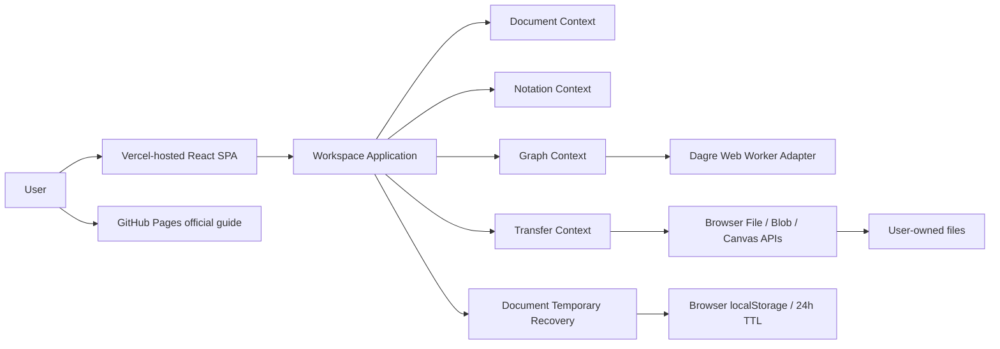
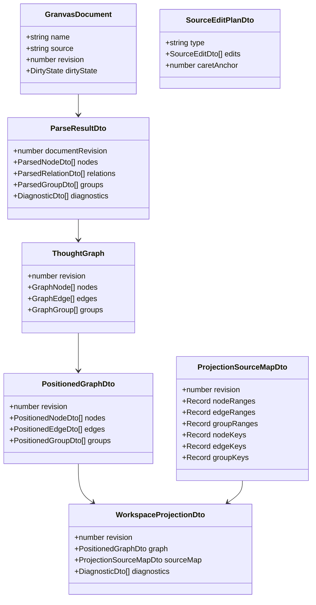
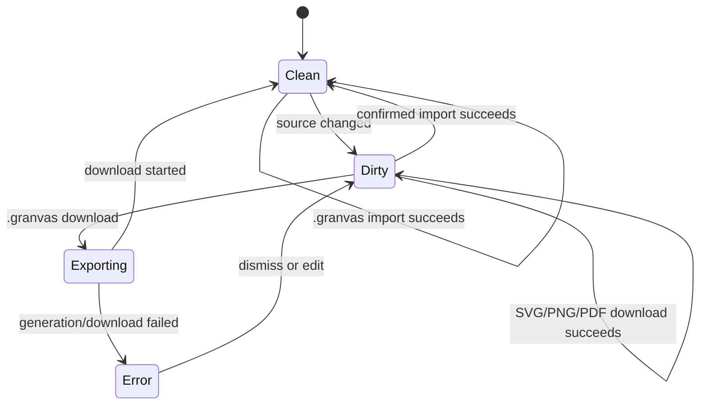
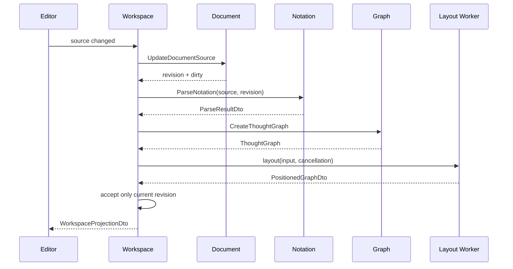
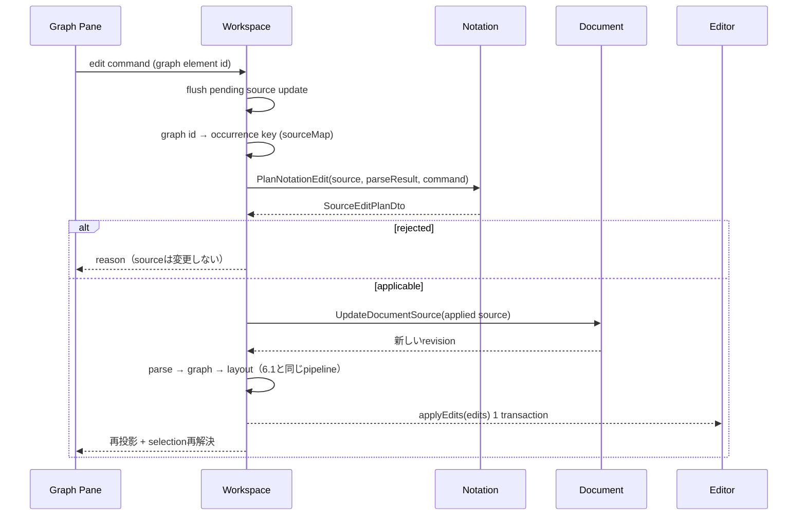
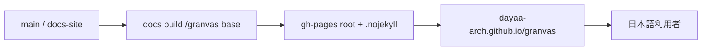
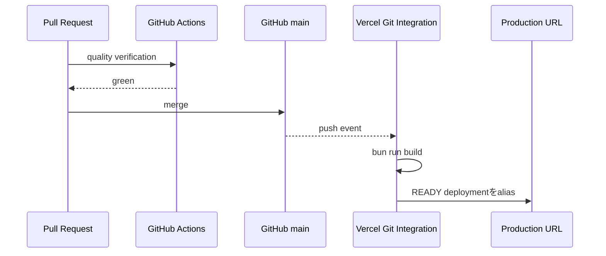

# Granvas 機能設計書

> Status: Release Candidate
> Target: v0.1  
> Updated: 2026-08-16
> Related: `docs/product-requirements.md`, `docs/GRANVAS_SPEC_v0.1.md`, `docs/adr/`

## 1. 設計目的

Textを正本とし、Notation解析・意味Graph・自動Layout・Text/Graph同期・Graph編集の書き戻し・Project file transferを、境界づけられたコンテキスト間の公開DTOで接続する。

Graph編集は「Graphの状態を変える」のではなく「現在のTextへ最小の編集列を適用し、再投影する」ものとして設計する。Graphからテキスト全文を再生成する経路は作らない。根拠は[ADR-0002](adr/0002-source-edit-plan-as-notation-domain-concern.md)。

## 2. システム構成



v0.1にserver-side component、database、authentication、remote APIは存在しない。Vercelはstatic assetのhostingだけを担当する。

Production deliveryはVercel ProjectのGit Integrationが担当する。GitHub Actionsのquality gateがgreenなPRを`main`へmergeすると、Vercelがそのpushを検知してstatic artifactをbuildし、`granvas.vercel.app`へ自動公開する。GitHub ActionsへVercel credentialやdeployment jobを追加しない。

公式利用ガイドはproduct runtimeから独立した静的siteとしてGitHub Pagesへ公開する。product applicationのstate、file、projectionへ接続せず、tracking、analytics、remote font、backend requestを持たない。

## 3. 画面設計

```text
┌──────────────────────────────────────────────────────────────┐
│ Granvas   思考を書く。構造が見える。 新しい 読み込む DL  │
├──────────────────────────────┬───────────────────────────────┤
│ テキスト                     │ グラフ                        │
│                              │                               │
│ [problem] ...                │      ┌ Problem ┐             │
│   -> [cause] ...             │      └────┬────┘             │
│                              │           ▼                  │
│                              │       ┌ Cause ┐              │
├──────────────────────────────┴───────────────────────────────┤
│ 未ダウンロード · 2行 5列 · Node 2件 / Edge 1件 · 診断 0件 │
└──────────────────────────────────────────────────────────────┘
```

### 3.1 Top Bar

- `新しいGranvas`: 現在Projectを保持し、空の`untitled` Projectを新しいtabで開く。
- `プロジェクトを読み込む`: `.granvas`を選択する。
- `ダウンロード`: file nameと `.granvas` / SVG / PNG / PDFを選択するdialogを開く。
- `新しいGranvas`は新しいtabで開くことをaccessible nameで示し、`noopener,noreferrer`を適用する。
- account / cloud / share UIは表示しない。

### 3.2 Text Editor

- CodeMirror 6を使用する。
- line number、cursor position、syntax highlight、diagnostic decorationを表示する。
- 確信度マーカーとrelation operatorをtypeとは別トークンとしてhighlightする。
- Node selection commandは宣言行全体のUTF-16半開区間を受け取る。
- Graph編集の適用は`applyEdits(edits, select?)`で受け取り、全文置換しない。
- 複数レンジの変更は1トランザクションでdispatchし、Undo 1回で戻せる状態にする。
- 全文置換の経路はProject Import専用として残す。
- 適用中はeditor由来の`onSourceChange`を再入させない。
- IME composition中の一時diagnosticは確定表示しない。

### 3.3 Graph Pane

- React Flowを使用する。
- Pan / Zoom / Fit Viewを提供する。
- Nodeはkeyboard focus可能とし、Enter / SpaceでTextへ移動する。
- GroupはNodeのparentではなく、重なり可能なbackground overlayとして描画する。
- certaintyの4状態を線種・バッジ・テキスト装飾で描き分け、colorだけに依存しない。
- `rejected`なNode / Edgeを非表示にしない。
- Nodeのdouble clickでラベルのinline編集に入る。Enterで確定、Escapeで取消。
- キャンバス空白のdouble clickでNodeを作成する。
- Node handleのドラッグでEdgeを作成する。
- Node dragは意味ドラッグとして扱う。ドラッグ中はdrop先候補をハイライトし、確定後は新しい配置へアニメーション遷移する。
- 座標は保存しない。ドロップ位置ではなくドロップ先が何であったかだけを意味として解釈する。
- 削除は連鎖対象を事前提示してから実行する。
- すべての編集操作へkeyboardから到達できる経路を用意する。

### 3.4 Download Dialog

- file name入力。
- format選択。
- diagnostics件数とvisual formatがvalid projectionだけを含む旨の通知。
- Graphが空の場合はvisual formatをdisabledにする。
- PNG / PDFは利用可能とし、8192px上限へ縮小した場合は完了通知へ理由を追記する。
- Escapeでcancelし、終了後はDownload buttonへfocusを戻す。

### 3.5 UI Language

- 製品UIは日本語を標準とする。
- visible text、accessible name、tooltip、dialog、`aria-live`、diagnostic、transfer / graph edit errorを日本語化する。
- Notation token、Node Type、Explicit ID、format名、製品名は翻訳しない。
- `Saved / Unsaved`は自動保存と誤解させないよう`ダウンロード済み / 未ダウンロード`と表現する。
- `.granvas`の`ダウンロード済み / 未ダウンロード`とは別に、`24時間一時保存`の成功・利用不可を表示する。
- `certainty`は`確信度`、`neutral / tentative / confirmed / rejected`は`指定なし / 未確定 / 確定 / 棄却`とする。
- Domain / Applicationが返すmachine-readable codeを維持し、presentationがcodeを日本語表示文へ変換する。
- runtime locale switchと多言語化frameworkはv0.1に導入しない。

## 4. Bounded Context

### 4.1 Document

責務:

- single active document。
- single active documentはbrowser tab単位とし、Project一覧やtab間同期を持たない。
- source、revision、clean baseline、dirty state。
- source更新とProject置換。

公開Use Case:

- `CreateDocument`
- `UpdateDocumentSource`
- `ReplaceDocumentSource`
- `MarkProjectDownloaded`

DocumentはFile API、CodeMirror、Parserを知らない。

### 4.2 Notation

責務:

- Notation candidate分類。
- indentation stateとGroup scope。
- syntax / semantics / diagnostics / certainty。
- source mapping、token spans、occurrence key。
- **編集規則**。Graph操作をTextの最小編集列へ変換するpure function群を所有する。

公開Use Case:

- `ParseNotation`
- `PlanNotationEdit`

`PlanNotationEdit`は`(source, parseResult, command)`から`SourceEditPlanDto`を返すだけで、編集を適用しない。適用と再投影はWorkspaceの責務。

「A と B を接続する」といった操作はGranvas Notationの文法知識（`@id`の有無、挿入位置、Group scopeやparent stackを壊さないか）を必要とするため、Graphではなく Notation が所有する。

NotationはUI、Graph、Documentを知らない。domainはReact / CodeMirror / React Flow / DOM / browser APIを参照しない。

### 4.3 Graph

責務:

- framework-independentなSemantic Graph。
- Layout inputの生成。
- Dagre worker port経由の位置計算。
- Group overlay boundsとexport scene。

公開Use Case:

- `CreateThoughtGraph`
- `LayoutThoughtGraph`
- `CreateGraphExportScene`

Graph Domainは`SourceRange`を保持しない。

### 4.4 Transfer

責務:

- `.granvas` file選択とvalidation。
- Download format / file nameのvalidation。
- `.granvas` / SVG / PNG / PDF生成とbrowser download。

公開Use Case:

- `ImportProjectFile`
- `DownloadProject`
- `DownloadGraph`

TransferはDocument / Graphの内部型をimportせず、Workspaceから公開DTOを受け取る。

### 4.5 Workspace

責務:

- 4 Contextのapplication APIを協調させる。
- parse → graph → layout pipeline。
- revision / cancellation / latest-wins。
- Graph IDとSourceRange / occurrence keyの対応。
- Text / Graph selection。
- Graph編集のorchestration（key解決 → 編集計画取得 → source適用 → 再投影 → selection再解決）。
- dirty confirmationを伴うImport / New。

Workspaceは他Contextのdomain / infrastructureを直接importしない。**Notationの文法知識も持たない。** 記法文字列の組み立ては行わず、編集列はNotationから受け取ったものをそのまま適用する。

## 5. データモデル



### 5.1 SourceRange

- `from`: 0-based UTF-16 code-unit offset。
- `to`: exclusive。
- `line`: 1-based開始行。
- `column`: 0-based UTF-16開始column。
- Node primary rangeはline endingを除く宣言行全体。
- CRLFはoffset上2 code unitsとして保持する。

primary rangeは宣言行全体を指すため、ラベルだけの置換や`@id`だけの挿入を表現できない。Graph編集が最小差分を計算できるよう、各構造要素はtoken単位の`spans`も持つ。

- Node: `indent` / `certainty` / `type` / `explicitId` / `idInsertionPoint` / `label`。
- Relation: `operator` / `sourceRef` / `targetRef` / `label` / `labelInsertionPoint`。
- Group: `header` / `name` / `memberInsertionPoint`。

すべてのspanはprimary rangeの内側に収まり、offset規約はprimary rangeと同一とする。

### 5.2 Identity

- `explicitId`: user-facing reference ID。任意でありduplicate errorを許容する。
- occurrence `key`: Parserが全構造要素へ付与する一意な内部ID。
- Graph ID: occurrence keyから決定的に生成する。
- Graph IDからoccurrence keyへの逆引きは`ProjectionSourceMapDto`の`*Keys`を経由する。Graph IDの生成規則をWorkspace側で再現しない。
- revisionが変わったらWorkspaceはselectionをcurrent SourceRangeから再解決する。
- Graph編集後は`caretAnchor`を編集列でマップし、再投影後のselectionを再解決する。

### 5.3 Dirty State



## 6. 主要フロー

### 6.1 Typing / Projection



新しいrevisionを開始したら古いlayoutをcancelする。cancel不能でもcurrent revisionと一致しない結果は破棄する。

### 6.2 Graph Edit



- Graph編集はdebounceしない。ユーザーの確定操作への応答であり、遅延させる理由がない。
- 開始前にpendingなsource更新を必ずflushする。怠ると古い解析結果のoffsetへpatchを当て、誤った位置を書き換える。
- editorとWorkspaceの双方へ同じ編集列が渡るため、editor側の適用が`onSourceChange`を再入させないようガードする。
- IME composition中はGraph編集を受け付けない。
- 編集列は適用前sourceを基準とし、`from`昇順で重複しない。

### 6.3 Import Project

1. dirtyなら置換確認を表示する。
2. Transferが`.granvas`を選択する。
3. extension、5 MiB、UTF-8を検証する。
4. BOMを除去し、改行を保持する。
5. Document sourceを置換してrevisionを更新する。
6. projectionを再構築し、Fit Viewする。
7. read / decode / validation失敗時は既存Projectを維持する。

### 6.4 Download

1. file nameとformatを取得する。
2. `.granvas`はcurrent sourceからBlobを生成する。
3. visual formatはcurrent revisionの`GraphExportSceneDto`を使用する。
4. Adapterがuntrusted textとcertaintyを共通SVG sceneへ安全に描画する。
5. PNGはSVGを2x Canvasへrasterizeし、PDFはそのPNGをlazy-loaded `pdf-lib`で単一pageへ埋め込む。
6. Browser adapterがdownloadを開始する。
7. `.granvas`だけがclean baselineを更新する。visual formatの成功・失敗はdirty stateを変えない。

### 6.5 Temporary Browser Recovery

1. bootstrapがDocument Applicationのrecovery serviceへ現在時刻付きでloadを要求する。
2. validかつ期限内ならProject name / Text / dirty情報をdefault Projectより優先する。
3. expired / corrupt / unknown schemaなら値を削除し、default Projectを開く。
4. Workspaceが復元Textを通常どおりparse → Graph → layoutし、派生状態を再生成する。
5. Editorのpending sourceをprojection debounce前に保存し、Graph編集、Import、`.granvas` Download完了でもsnapshotを同期する。
6. write成功ごとに`expiresAt`を24時間先へ更新する。
7. storage failureは一時保存利用不可として表示し、Project変更自体は成功させる。

保存payloadはschema version、name、source、dirty、`savedAt`、`expiresAt`だけを含む。Graph、座標、projection、diagnostics、selection、Undo履歴は含めない。

storage keyは通常起動の`granvas:temporary-project:v1`を後方互換として維持する。`新しいGranvas`から開いたtabはvalidated UUIDを持つ`granvas:temporary-project:v1:<slot-id>`を使用し、tabごとに復元recordを分離する。

### 6.6 New Granvas Tab

1. Appが現在URLのfragmentを`#new`へ置換し、`noopener,noreferrer`付きで新しいtabを開く。
2. 新規tabのbootstrapが`#new`を検出し、`crypto.randomUUID()`でProject slot IDを生成する。
3. `history.replaceState`で`#project=<slot-id>`へ正規化する。
4. 同slotのvalidな一時保存があれば復元し、無ければ空Text / `untitled` / cleanでWorkspaceを開く。
5. 編集後はslot固有keyへ24時間一時保存し、元tabと別の新規tabのrecordを変更しない。

fragment解釈、UUID allowlist、canonical hash生成は`src/app/projectLaunch.ts`のpure resolverが担当する。browser objectはApp composition rootからのみ参照する。

## 7. Component Ownership

| Component | Owner | Dependency |
| --- | --- | --- |
| `GranvasEditor` | Notation presentation | Notation application DTO, CodeMirror |
| `ReactFlowGraphView` | Graph presentation | PositionedGraph ViewModel, React Flow |
| `DownloadDialog` | Transfer presentation | Transfer application ViewModel |
| `WorkspaceSplitPane` | Workspace presentation | shared presentation |
| `StatusBar` | Workspace presentation | Workspace ViewModel |
| `App` | app composition root | 各moduleのpublic presentation API |
| `ProjectLaunch` | app composition root | fragment解釈、初期Project / recovery key選択 |

各moduleのpresentation同士は内部importしない。`App.tsx`が公開componentとcallbackを合成する。

## 8. Port と実装場所

| Port | 定義 | 実装 |
| --- | --- | --- |
| `GraphLayoutPort` | `graph/application/ports` | `graph/infrastructure/DagreGraphLayoutWorkerAdapter` |
| `ProjectFilePickerPort` | `transfer/application/ports` | `transfer/infrastructure/BrowserProjectFilePickerAdapter` |
| `FileDownloadPort` | `transfer/application/ports` | `transfer/infrastructure/BrowserFileDownloadAdapter` |
| `GraphExportPort` | `transfer/application/ports` | `transfer/infrastructure/CompositeGraphExportAdapter` |
| `TemporaryProjectStoragePort` | `document/application/ports` | `document/infrastructure/browser/BrowserLocalStorageTemporaryProjectAdapter` |

具象は`src/app/bootstrap/createApplication.ts`で生成・注入する。

## 9. API / Authentication

v0.1にHTTP APIは存在しない。将来認証を追加する場合は`src/modules/identity/`を新設し、認証provider portをapplicationに、Supabase Auth adapterをinfrastructureに置く。Supabase SDK型をpublic contractへ漏らさない。

## 10. エラー設計

- Parserの入力誤りは`DiagnosticDto`として返し、例外で編集を停止しない。
- Layout errorはcurrent Textを維持し、Graph error stateを通知する。
- 実行できないGraph操作は例外ではなく`SourceEditPlanDto`の`rejected`として理由付きで返し、sourceとdirty stateを変更しない。理由は`aria-live`で通知する。
- Import / Download errorはTransfer resultとして返し、現在sourceを変更しない。
- unexpected errorはError Boundaryで捕捉し、sourceを`.granvas`として退避できる導線を優先する。

`rejected`の主な理由:

| code | 発生条件 |
| --- | --- |
| `unknown-target` | 指定されたoccurrence keyがcurrent parse resultに存在しない |
| `cyclic-parent` | 自分の子孫を親にする付け替え |
| `unresolved-reference` | 参照先のNodeを解決できない |
| `unsupported-structure` | 現在の記法で表現できない構造（nested Groupなど） |
| `invalid-value` | 空ラベル、ID規則を満たさないtypeなど |

## 11. 公式利用ガイド配布

公式利用ガイドのsourceはmain branchの`docs-site/`に置き、review済みsourceから生成した静的artifactを`gh-pages` branchのrootへ公開する。



- サイト名は`Granvas 1.0 公式ドキュメント — 完全版`、release状態は`完全版`とする。
- Docs edition 1.0と対応実装`Granvas v0.1 Release Candidate`を明示し、product v1.0とは区別する。
- Vercel production、SVG / PNG / PDF、MIT / SECURITY / CONTRIBUTING、quality gateへの導線を含める。
- 画面構成、Notation、確信度、Text / Graph navigation、Graph authoring、Project Download / Import、keyboard、FAQ、現在の制約を含める。
- screenshotは日本語UIのproduction buildから取得し、画像だけに意味を依存させない。
- semantic HTML、skip link、heading、alt、focus indicator、responsive layoutを備える。
- `.github/workflows/quality.yml`は検証だけを行い、custom Pages workflowを追加せずGitHub Pagesのlegacy branch sourceを使う。
- product applicationのVercel static hostingは変更しない。

## 12. Product Production Delivery



- Production Branchは`main`。
- GitHub Actionsはdeploymentを実行しない。
- Vercelはexisting `vercel.json`のbuild / output / rewrite / header contractを使う。
- merge後はsource commit、deployment state、production alias、live recoveryを確認する。
- application ContextとruntimeはGit Integrationを参照しない。
