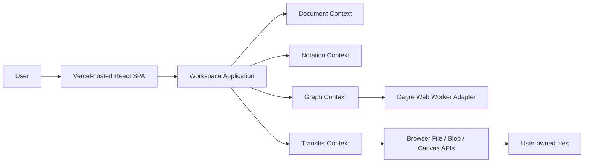
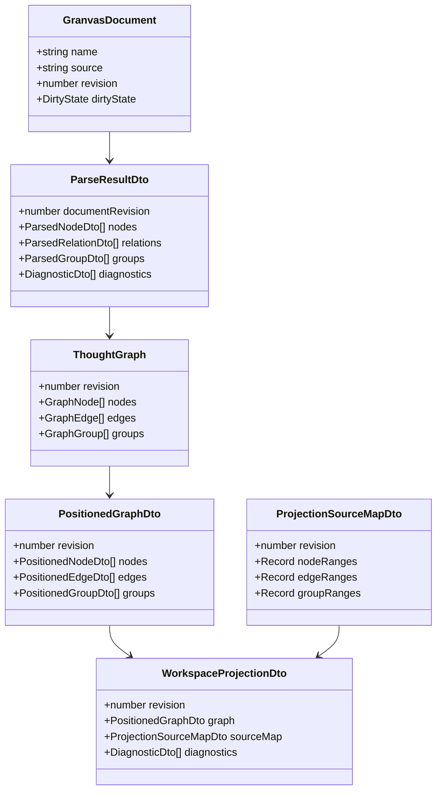
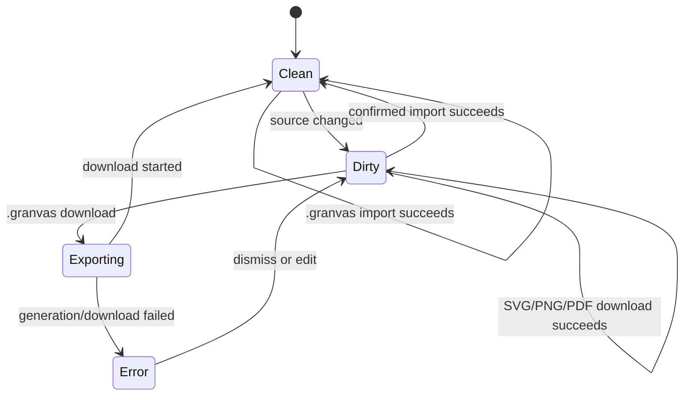
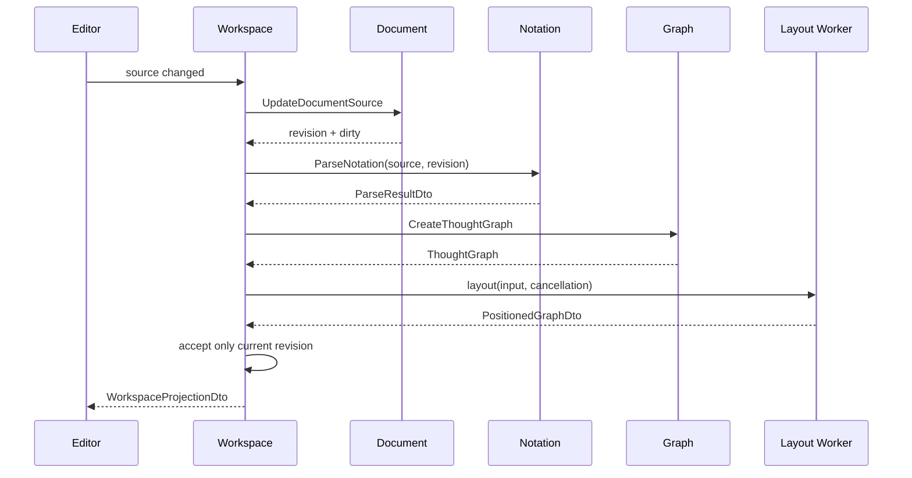

# Granvas 機能設計書

> Status: Draft / Approval Candidate  
> Target: v0.1  
> Updated: 2026-08-10  
> Related: `docs/product-requirements.md`, `docs/GRANVAS_SPEC_v0.1.md`

## 1. 設計目的

Textを正本とし、Notation解析・意味Graph・自動Layout・Text/Graph同期・Project file transferを、境界づけられたコンテキスト間の公開DTOで接続する。

## 2. システム構成



v0.1にserver-side component、database、authentication、remote APIは存在しない。Vercelはstatic assetのhostingだけを担当する。

## 3. 画面設計

```text
┌──────────────────────────────────────────────────────────────┐
│ Granvas   Write thoughts. See structure.  Import  Download  │
├──────────────────────────────┬───────────────────────────────┤
│ Text Editor                  │ Graph                         │
│                              │                               │
│ [problem] ...                │      ┌ Problem ┐             │
│   -> [cause] ...             │      └────┬────┘             │
│                              │           ▼                  │
│                              │       ┌ Cause ┐              │
├──────────────────────────────┴───────────────────────────────┤
│ Unsaved · Ln 2, Col 5 · 2 nodes / 1 edge · 0 diagnostics   │
└──────────────────────────────────────────────────────────────┘
```

### 3.1 Top Bar

- `Import Project`: `.granvas`を選択する。
- `Download`: file nameと `.granvas` / SVG / PNG / PDFを選択するdialogを開く。
- account / cloud / share UIは表示しない。

### 3.2 Text Editor

- CodeMirror 6を使用する。
- line number、cursor position、syntax highlight、diagnostic decorationを表示する。
- Node selection commandは宣言行全体のUTF-16半開区間を受け取る。
- IME composition中の一時diagnosticは確定表示しない。

### 3.3 Graph Pane

- React Flowを使用し、Node dragとGraph編集を無効化する。
- Pan / Zoom / Fit Viewを提供する。
- Nodeはkeyboard focus可能とし、Enter / SpaceでTextへ移動する。
- GroupはNodeのparentではなく、重なり可能なbackground overlayとして描画する。

### 3.4 Download Dialog

- file name入力。
- format選択。
- diagnostics件数とvisual formatがvalid projectionだけを含む旨の通知。
- Graphが空の場合はvisual formatをdisabledにする。
- Escapeでcancelし、終了後はDownload buttonへfocusを戻す。

## 4. Bounded Context

### 4.1 Document

責務:

- single active document。
- source、revision、clean baseline、dirty state。
- source更新とProject置換。

公開Use Case:

- `CreateDocument`
- `UpdateDocumentSource`
- `ReplaceDocumentSource`
- `MarkProjectDownloaded`

DocumentはFile API、CodeMirror、Parserを知らない。

### 4.2 Notation

責務:

- Notation candidate分類。
- indentation stateとGroup scope。
- syntax / semantics / diagnostics。
- source mappingとoccurrence key。

公開Use Case:

- `ParseNotation`

NotationはUI、Graph、Documentを知らない。

### 4.3 Graph

責務:

- framework-independentなSemantic Graph。
- Layout inputの生成。
- Dagre worker port経由の位置計算。
- Group overlay boundsとexport scene。

公開Use Case:

- `CreateThoughtGraph`
- `LayoutThoughtGraph`
- `CreateGraphExportScene`

Graph Domainは`SourceRange`を保持しない。

### 4.4 Transfer

責務:

- `.granvas` file選択とvalidation。
- Download format / file nameのvalidation。
- `.granvas` / SVG / PNG / PDF生成とbrowser download。

公開Use Case:

- `ImportProjectFile`
- `DownloadProject`
- `DownloadGraph`

TransferはDocument / Graphの内部型をimportせず、Workspaceから公開DTOを受け取る。

### 4.5 Workspace

責務:

- 4 Contextのapplication APIを協調させる。
- parse → graph → layout pipeline。
- revision / cancellation / latest-wins。
- Graph IDとSourceRangeの対応。
- Text / Graph selection。
- dirty confirmationを伴うImport / New。

Workspaceは他Contextのdomain / infrastructureを直接importしない。

## 5. データモデル



### 5.1 SourceRange

- `from`: 0-based UTF-16 code-unit offset。
- `to`: exclusive。
- `line`: 1-based開始行。
- `column`: 0-based UTF-16開始column。
- Node primary rangeはline endingを除く宣言行全体。
- CRLFはoffset上2 code unitsとして保持する。

### 5.2 Identity

- `explicitId`: user-facing reference ID。任意でありduplicate errorを許容する。
- occurrence `key`: Parserが全構造要素へ付与する一意な内部ID。
- Graph ID: occurrence keyから決定的に生成する。
- revisionが変わったらWorkspaceはselectionをcurrent SourceRangeから再解決する。

### 5.3 Dirty State



## 6. 主要フロー

### 6.1 Typing / Projection



新しいrevisionを開始したら古いlayoutをcancelする。cancel不能でもcurrent revisionと一致しない結果は破棄する。

### 6.2 Import Project

1. dirtyなら置換確認を表示する。
2. Transferが`.granvas`を選択する。
3. extension、5 MiB、UTF-8を検証する。
4. BOMを除去し、改行を保持する。
5. Document sourceを置換してrevisionを更新する。
6. projectionを再構築し、Fit Viewする。
7. read / decode / validation失敗時は既存Projectを維持する。

### 6.3 Download

1. file nameとformatを取得する。
2. `.granvas`はcurrent sourceからBlobを生成する。
3. visual formatはcurrent revisionの`GraphExportSceneDto`を使用する。
4. Adapterがuntrusted textをescapeしてfileを生成する。
5. Browser adapterがdownloadを開始する。
6. `.granvas`だけがclean baselineを更新する。

## 7. Component Ownership

| Component | Owner | Dependency |
| --- | --- | --- |
| `GranvasEditor` | Notation presentation | Notation application DTO, CodeMirror |
| `ReactFlowGraphView` | Graph presentation | PositionedGraph ViewModel, React Flow |
| `DownloadDialog` | Transfer presentation | Transfer application ViewModel |
| `WorkspaceSplitPane` | Workspace presentation | shared presentation |
| `StatusBar` | Workspace presentation | Workspace ViewModel |
| `App` | app composition root | 各moduleのpublic presentation API |

各moduleのpresentation同士は内部importしない。`App.tsx`が公開componentとcallbackを合成する。

## 8. Port と実装場所

| Port | 定義 | 実装 |
| --- | --- | --- |
| `GraphLayoutPort` | `graph/application/ports` | `graph/infrastructure/DagreGraphLayoutWorkerAdapter` |
| `ProjectFilePickerPort` | `transfer/application/ports` | `transfer/infrastructure/BrowserProjectFilePickerAdapter` |
| `FileDownloadPort` | `transfer/application/ports` | `transfer/infrastructure/BrowserFileDownloadAdapter` |
| `GraphExportPort` | `transfer/application/ports` | `transfer/infrastructure/*GraphExportAdapter` |

具象は`src/app/bootstrap/createApplication.ts`で生成・注入する。

## 9. API / Authentication

v0.1にHTTP APIは存在しない。将来認証を追加する場合は`src/modules/identity/`を新設し、認証provider portをapplicationに、Supabase Auth adapterをinfrastructureに置く。Supabase SDK型をpublic contractへ漏らさない。

## 10. エラー設計

- Parserの入力誤りは`DiagnosticDto`として返し、例外で編集を停止しない。
- Layout errorはcurrent Textを維持し、Graph error stateを通知する。
- Import / Download errorはTransfer resultとして返し、現在sourceを変更しない。
- unexpected errorはError Boundaryで捕捉し、sourceを`.granvas`として退避できる導線を優先する。
